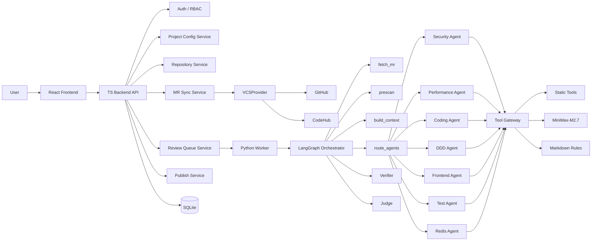

# Jolt CodeReview Production Delivery Execution Plan

> **For Claude:** REQUIRED SUB-SKILL: Use superpowers:executing-plans to implement this plan task-by-task.

**Goal:** 将 Jolt CodeReview 建设成可在公司内网生产环境部署的 AI 代码检视平台，支持 GitHub / CodeHub MR 自动同步、项目级隔离、多专家 Agent 检视、静态工具增强、用户确认后发布评论。

**Architecture:** 采用前后端分离架构：React Frontend 负责统一工作台、状态展示和人工确认；TypeScript Backend 负责用户权限、项目配置、VCS 接入、队列、审计和发布；Python Worker 负责 LangGraph 多 Agent 编排、静态工具、代码上下文构建、LLM 调用和结果治理。MVP 使用 SQLite，保留迁移 PostgreSQL、Redis 队列和多 Worker 的边界。

**Tech Stack:** React, TypeScript, Vite, Node.js, SQLite, Python, LangGraph, DeepAgents bounded mode, MiniMax-M2.7 OpenAI-compatible API, GitHub API, CodeHub API, Semgrep, gitleaks, ESLint, ruff, bandit, Tree-sitter, GitNexus.

---

## 1. 执行目标

本方案面向落地执行，不再重复产品愿景。研发完成后，系统必须跑通下面闭环：

1. 用户登录后进入项目级工作台。
2. 项目绑定多个 GitHub / CodeHub 仓库。
3. 系统启动后自动同步项目下所有活跃仓库的 open MR/PR。
4. 新 MR/PR 或新 head_sha 幂等进入后台检视队列。
5. Python Worker 按队列策略执行：拉取变更、静态预扫描、结构化上下文、多专家 Agent 检视、Verifier/Judge 归并。
6. 检视过程完整记录 Agent 对话、工具调用、LLM 调用、MCP 预留调用、artifact 和审计日志。
7. 前端 MR 列表展示状态，详情页展示问题、证据、过程和调用记录。
8. 用户选择问题后，手动提交评论到 GitHub / CodeHub。
9. 误报、采纳、重新检视、队列失败都可追踪。

## 2. 生产边界

### 2.1 当前必须支持

| 能力 | 要求 |
| --- | --- |
| 数据源 | GitHub Pull Request、CodeHub Merge Request |
| 模型 | 公司内网 MiniMax-M2.7，OpenAI-compatible API |
| 本机配置 | 根目录 `config.json` 保存本机调试配置，项目配置存 SQLite |
| 操作系统 | macOS、Linux、Windows PowerShell |
| 数据库 | SQLite + WAL + project_id 隔离 |
| 前端风格 | 蓝白企业工作台，按给定原型布局 |
| 人工确认 | AI 不自动发布评论，必须用户手动提交 |

### 2.2 暂不实现但必须预留

| 能力 | 预留方式 |
| --- | --- |
| 全量代码检视 | 前端统一 Shell + 独立 full-review API namespace |
| PostgreSQL | Repository 层封装 SQL，避免 route 直接访问 DB |
| Redis / MQ | ReviewQueueService 抽象队列规则 |
| 多 Worker | job lock、heartbeat、reclaim、dead-letter |
| Docker/K8s sandbox | Worker sandbox 路径和 artifact URI 抽象 |
| MCP 扩展 | ToolGateway 统一拦截和记录 |

## 3. 总体架构



## 4. 模块职责

### 4.1 Frontend

| 模块 | 职责 |
| --- | --- |
| App Shell | 登录态、项目选择、左侧导航、顶部搜索、用户菜单 |
| MR 队列页 | 展示 MR/PR 列表、风险、状态、问题数、同步状态 |
| MR 详情页 | 展示流程进度、AI 问题、证据、选中状态、提交按钮 |
| 过程追踪页签 | 展示 Agent 对话、工具调用、LLM 调用、artifact |
| 规则库页 | Markdown 规范文档上传、版本、绑定专家 |
| 专家 Agent 页 | 画像、职责范围、排除范围、阈值、工具、规则绑定 |
| 代码仓页 | GitHub / CodeHub 仓库绑定、启停、同步状态 |
| 队列运维页 | 队列长度、运行中、重试、死信、卡住任务 |
| 用户权限页 | 项目成员、角色、操作权限 |

前端不能直接调用 GitHub、CodeHub、LLM 或 Python Worker，只调用 TS Backend。

### 4.2 TS Backend

| 模块 | 职责 |
| --- | --- |
| routes | HTTP API 注册，不写复杂业务 |
| repositories | SQLite 读写封装 |
| services | 项目配置、MR 同步、队列、发布、审计、质量统计 |
| vcs | GitHub / CodeHub provider 归一化 |
| middleware | auth、RBAC、错误处理、审计上下文 |
| config | `config.json` 默认配置、环境变量覆盖、Windows 路径兼容 |

### 4.3 Python Worker

| 模块 | 职责 |
| --- | --- |
| queue | job 获取、heartbeat、retry、dead-letter |
| orchestration | LangGraph 状态图和节点 |
| agents | 专家画像、规则注入、prompt 构造、输出解析 |
| tools | 静态工具 wrapper、ToolGateway、工具结果标准化 |
| rules | Markdown 规范解析和绑定加载 |
| trace | span、event、message、tool call、llm call、artifact 记录 |

## 5. 项目级配置模型

项目是隔离边界。所有配置必须带 `project_id`，禁止使用全局隐式状态。

| 配置项 | 存储 | 内容 |
| --- | --- | --- |
| `llm_policy` | SQLite `project_settings` | provider、base_url、model、api_key_ref、temperature、timeout |
| `review_policy` | SQLite | effort level、最大问题数、风险阈值 |
| `agent_policy` | SQLite | 启用专家、并发数、最大 LLM 调用 |
| `tool_policy` | SQLite | 启用工具、禁用工具、缺失工具策略 |
| `queue_policy` | SQLite | 轮询间隔、并发、重试、dead-letter |
| `publish_policy` | SQLite | 可发布严重级别、评论格式、目标平台能力 |
| `data_policy` | SQLite | 敏感路径、prompt 留存、diff 行数上限 |

本机 `config.json` 只作为部署默认值和调试配置。有效配置计算规则：

```text
effective_config = config.json defaults
                 + project_settings
                 + repository provider_config_json
```

MiniMax-M2.7 本机调试默认配置：

```json
{
  "llm": {
    "default_provider": "dashscope-openai-compatible",
    "default_base_url": "https://ark.cn-beijing.volces.com/api/coding/v3",
    "default_model": "MiniMax-M2.7",
    "default_api_key_env": null,
    "default_api_key": "<local-debug-only>"
  }
}
```

生产环境必须改成 `default_api_key_env` 或 secret store，不允许明文 key 入库或提交。

## 6. 多 Agent 执行架构

采用“外层 LangGraph 确定性流程 + 内层单层专家 Agent”的方式。

### 6.1 LangGraph 节点顺序

```text
fetch_mr
choose_effort
prescan
build_context
route_agents
run_experts
verify_findings
detect_conflicts
run_targeted_debate
judge_findings
finalize
```

### 6.2 DeepAgents 使用约束

DeepAgents 只用于专家节点内的受控能力：

1. skill 加载。
2. tool 调用。
3. scoped filesystem / context。

禁止专家 Agent 再 spawn 子 Agent。调度权属于 LangGraph，避免多层 Agent 失控。

### 6.3 预置专家

| Agent | 角色画像 | 唯一检视范围 | 排除范围 |
| --- | --- | --- | --- |
| `security_agent` | 安全审计专家 | 鉴权、越权、注入、敏感信息、反序列化、SSRF、XSS | 性能调优、UI 样式、测试覆盖 |
| `performance_agent` | 性能容量专家 | N+1、慢查询、循环 IO、缓存穿透、批处理、资源释放 | 权限、安全漏洞、DDD 命名 |
| `coding_agent` | 通用编码质量专家 | 空指针、边界条件、异常处理、幂等、可维护性 | 专属安全、前端交互、Redis 专项 |
| `ddd_agent` | DDD 设计专家 | 聚合边界、领域服务、仓储、领域事件、事务一致性 | 语法 lint、样式、测试断言 |
| `frontend_agent` | 前端工程专家 | React 状态、hooks、可访问性、交互、布局、前端安全 | 后端 API 事务、Redis 使用 |
| `test_agent` | 测试质量专家 | 单测、集成测试、回归覆盖、边界用例、mock 合理性 | 业务架构设计、安全专项 |
| `redis_agent` | Redis 专家 | key 设计、TTL、热点 key、分布式锁、pipeline、Lua | HTTP 权限、前端样式 |
| `backend_agent` | 后端工程专家 | API 契约、事务、服务分层、数据库访问 | 已被安全、性能、Redis 覆盖的问题 |

每个专家最终检视结果 = 角色定义检视结果 + 绑定 Markdown 规范逐条检视结果。两部分取并集，再进入 Verifier/Judge。

## 7. 静态工具增强

静态工具输出统一进入 `tool_observations`，不得直接进入 `review_findings`。

| 工具 | 适用范围 | 输出状态 |
| --- | --- | --- |
| Semgrep | 多语言安全/通用规则 | `available` / `missing` / `failed` |
| gitleaks | secret 泄露 | `available` / `missing` / `failed` |
| ESLint | JS/TS/React | `available` / `missing` / `failed` |
| ruff | Python lint | `available` / `missing` / `failed` |
| bandit | Python 安全 | `available` / `missing` / `failed` |
| PMD | Java 报告解析 | `requires_report` / `available` |
| Checkstyle | Java 规范报告 | `requires_report` / `available` |
| SpotBugs | Java bug pattern | `requires_report` / `available` |
| JaCoCo | 测试覆盖报告 | `requires_report` / `available` |
| Tree-sitter | 代码结构和符号 | `available` / `missing` |
| GitNexus | 影响路径分析 | `available` / `missing` |

工具处理规则：

1. 缺失工具不导致检视失败。
2. 缺失、失败、禁用必须写入 `toolchain_manifest`。
3. 工具候选信号必须由专家 Agent 或 Judge 采纳后才成为 finding。
4. 工具调用必须走 ToolGateway，并记录 `tool_call_records`。

## 8. 自动队列设计

### 8.1 入队规则

| 场景 | 动作 |
| --- | --- |
| open MR 首次同步 | 插入 queued job |
| 同一 `(merge_request_id, head_sha)` 重复同步 | 幂等忽略 |
| MR 推送新 head_sha | 旧 queued job 标记 superseded，新 head_sha 入队 |
| MR closed / merged | queued job 标记 cancelled |
| Worker 执行失败 | attempt + 1，按 backoff 重新 queued |
| 达到最大重试 | 标记 dead_letter |
| Worker 卡死 | heartbeat 超过 60 秒未更新则 reclaim |

### 8.2 队列状态

```text
queued
fetching
pre_scanning
reviewing
judging
waiting_confirmation
no_issue
submitted
failed
superseded
cancelled
dead_letter
```

### 8.3 启动自动同步

系统启动后执行：

1. TS Backend 加载 active projects。
2. 每个项目加载 active repositories。
3. MrAutoSyncScheduler 立即同步一次 open MR。
4. 根据项目 `queue_policy.poll_interval_seconds` 周期同步。
5. Webhook 作为主通道，poll 作为兜底。

## 9. 过程记录与审计

| 表 | 记录内容 |
| --- | --- |
| `agent_trace_spans` | LangGraph 节点、专家 Agent、Judge 执行片段 |
| `agent_trace_events` | 节点开始结束、路由、过滤、异常、候选 finding |
| `agent_messages` | Agent 之间的任务交接、辩论、系统指令摘要 |
| `tool_call_records` | 工具名称、参数摘要、输出摘要、状态、耗时 |
| `llm_call_records` | provider、model、prompt_hash、token、耗时、状态 |
| `mcp_call_records` | MCP server、tool、请求摘要、响应摘要 |
| `review_artifacts` | diff、prescan、上下文、工具报告、最终报告 |
| `audit_logs` | 配置变更、同步、重试、发布、误报反馈 |

数据安全要求：

1. token、api key、Authorization header 不落库。
2. prompt 默认只存 hash 和摘要。
3. 敏感路径按 `data_policy` 跳过或脱敏。
4. artifact 定期清理，生产环境默认 30 天。

## 10. 前端原型执行要求

前端按蓝白企业级工作台实现，参考当前给定原型图。

### 10.1 页面结构

```text
左侧导航：项目 / MR 队列 / 规则库 / 专家 Agent / 代码仓 / 检视策略 / 用户权限 / 系统设置
顶部栏：面包屑 / 搜索 / 同步状态 / 刷新 / 绑定仓库
主区域左：MR 队列、状态筛选、风险筛选、仓库筛选
主区域右：MR 详情、流程进度、指标卡、AI 问题列表、操作按钮
```

### 10.2 UX 原则

1. 用户进入项目后默认看到 MR 列表和状态。
2. 默认自动同步，手动刷新只是补充。
3. 问题默认按严重级别和置信度排序。
4. 提交评论前支持勾选、取消、标记误报。
5. 过程记录放在详情页 tab，不干扰主操作。
6. 缺失工具、队列失败、模型失败必须有清晰状态。
7. 后期全量检视接入时复用同一 Shell，不重做入口。

## 11. API 契约

### 11.1 通用 API

```text
GET    /api/me
GET    /api/projects
GET    /api/projects/:projectId/settings
PATCH  /api/projects/:projectId/settings/:key
GET    /api/projects/:projectId/effective-config
GET    /api/projects/:projectId/repositories
POST   /api/projects/:projectId/repositories
GET    /api/projects/:projectId/members
```

### 11.2 MR Review API

```text
GET    /api/mr-review/projects/:projectId/merge-requests
POST   /api/mr-review/projects/:projectId/sync
GET    /api/mr-review/merge-requests/:mrId
POST   /api/mr-review/merge-requests/:mrId/review-jobs
POST   /api/mr-review/review-jobs/:jobId/retry
POST   /api/mr-review/merge-requests/:mrId/publish
```

### 11.3 Agent / Rule / Tool API

```text
GET    /api/projects/:projectId/expert-profiles
PATCH  /api/projects/:projectId/expert-profiles/:agentKey
GET    /api/projects/:projectId/rule-documents
POST   /api/projects/:projectId/rule-documents
GET    /api/projects/:projectId/expert-rule-bindings
POST   /api/projects/:projectId/expert-rule-bindings
GET    /api/projects/:projectId/expert-tool-bindings
POST   /api/projects/:projectId/expert-tool-bindings
GET    /api/projects/:projectId/toolchain/status
```

### 11.4 Webhook API

```text
POST   /api/webhooks/github
POST   /api/webhooks/codehub
```

Webhook 必须验签、幂等、记录审计。GitHub `pull_request.synchronize` 和 CodeHub pushed event 统一归一化为 `mr.pushed`。

## 12. 开发执行阶段

### Phase P0: 基线保护

**目标:** 所有重构前先锁住现有行为。

**状态:** 已完成。

**验收命令:**

```bash
npm run verify:production-baseline
npm run verify:design
npm run build
```

### Phase P1: TS Backend 结构拆分

**目标:** 完成 DB、Repository、Route、App/Server 拆分。

**状态:** 已完成。

**验收命令:**

```bash
npm run build
npm run smoke
npm run verify:local
```

### Phase P2: 项目级配置平台

**目标:** `config.json` 作为默认配置，SQLite 保存项目级覆盖配置。

**状态:** 已完成。

**验收命令:**

```bash
npm run build
npm run smoke
```

人工核验：

```text
GET /api/projects/project_default/settings
GET /api/projects/project_default/effective-config
```

### Phase P3: 专家 Agent 平台

**目标:** 预制专家画像、职责范围、Markdown 规则绑定、工具绑定。

**状态:** 已完成基础能力，后续补前端配置页。

**验收命令:**

```bash
npm run verify:agents
npm run build
npm run smoke
```

### Phase P4: 静态工具系统

**目标:** 多工具预扫描，统一 `tool_observations`，不直接生成 finding。

**状态:** 已完成基础 wrapper 和候选证据模型。

**验收命令:**

```bash
npm run build
npm run smoke
python3 -m py_compile worker/tools/*.py worker/orchestration/nodes/*.py
```

### Phase P5: 自动同步与队列

**目标:** 同步服务、队列服务、启动自动同步、队列可靠性。

**当前状态:** P5.1 已完成，P5.2/P5.3 待完成或待最终验收。

**任务 P5.2: ReviewQueueService**

**Files:**
- Create: `src/backend/services/ReviewQueueService.ts`
- Modify: `src/backend/repositories/ReviewJobRepository.ts`
- Modify: `src/backend/services/MrSyncService.ts`
- Modify: `src/backend/routes/review.routes.ts`
- Modify: `src/backend/routes/webhooks.routes.ts`
- Create: `worker/queue/job_consumer.py`
- Create: `scripts/verify-queue-reliability.mjs`

**Acceptance:**
- 幂等入队。
- 新 head_sha supersede 旧 queued job。
- closed/merged cancel queued job。
- retry 支持 backoff。
- dead-letter after max attempts。
- stale heartbeat reclaim。

**Verification:**

```bash
npm run build
npm run verify:queue-reliability
npm run smoke
python3 -m py_compile worker/review_worker.py worker/queue/job_consumer.py
```

**任务 P5.3: MrAutoSyncScheduler**

**Files:**
- Create: `src/backend/services/MrAutoSyncScheduler.ts`
- Modify: `src/backend/server.ts`
- Modify: `src/backend/app.ts`
- Modify: `scripts/start-all.mjs`

**Acceptance:**
- API 启动后自动同步一次。
- 按项目 queue_policy 周期同步。
- 测试模式不启动重复 scheduler。
- 前端无需手动刷新也能看到新 MR。

**Verification:**

```bash
npm run build
npm run smoke
npm run verify:e2e
```

### Phase P6: Python Worker 编排拆分

**目标:** 将 `worker/review_worker.py` 拆成清晰模块，补冲突检测和定向辩论。

**Files:**
- Create: `worker/orchestration/graph.py`
- Create: `worker/orchestration/state.py`
- Create: `worker/orchestration/nodes/fetch_mr.py`
- Create: `worker/orchestration/nodes/choose_effort.py`
- Create: `worker/orchestration/nodes/prescan.py`
- Create: `worker/orchestration/nodes/route_agents.py`
- Create: `worker/orchestration/nodes/run_experts.py`
- Create: `worker/orchestration/nodes/verify_findings.py`
- Create: `worker/orchestration/nodes/detect_conflicts.py`
- Create: `worker/orchestration/nodes/run_targeted_debate.py`
- Create: `worker/orchestration/nodes/judge_findings.py`
- Create: `worker/orchestration/nodes/finalize.py`
- Modify: `worker/review_worker.py`

**Acceptance:**
- `review_worker.py` 只保留 CLI、连接 DB、启动 consumer。
- 每个节点单一职责。
- 冲突检测只针对冲突 finding，不全量辩论。
- 辩论 transcript 进入 `agent_messages`。
- Judge 看到冲突和辩论结果。

**Verification:**

```bash
python3 -m py_compile worker/**/*.py
npm run build
npm run smoke
npm run verify:e2e
```

### Phase P7: 可观测性与质量治理

**目标:** 提供生产运维和质量闭环能力。

**Files:**
- Create: `src/backend/services/ObservabilityService.ts`
- Create: `src/backend/routes/observability.routes.ts`
- Create: `src/backend/services/FeedbackLearningService.ts`
- Modify: `src/backend/app.ts`
- Modify: `worker/orchestration/nodes/judge_findings.py`

**APIs:**

```text
GET /api/projects/:projectId/queue/summary
GET /api/projects/:projectId/toolchain/status
GET /api/projects/:projectId/agents/quality
GET /api/projects/:projectId/review-quality/summary
POST /api/mr-review/findings/:findingId/feedback
```

**Acceptance:**
- 可查看队列长度、失败率、平均检视耗时。
- 可查看工具可用性。
- 可查看 Agent 采纳率、误报率。
- 误报反馈只影响 Judge，不直接改变 Agent 原始输出。

**Verification:**

```bash
npm run build
npm run smoke
npm run verify:e2e
```

### Phase P8: 前端生产化页面

**目标:** 补齐生产运维和配置页面，保持蓝白工作台风格。

**Files:**
- Modify: `src/frontend/main.tsx`
- Modify: `src/frontend/styles.css`

**Pages:**
- 专家 Agent 配置页。
- Markdown 规则库页。
- 工具链状态页。
- 队列运维页。
- 用户权限页。
- MR 详情过程追踪 tab。

**Acceptance:**
- 项目管理员可配置 Agent 画像、范围、规则和工具。
- 检视确认人可确认、取消、标记误报、发布评论。
- 操作员可看到 queue/dead-letter/stuck job。
- 页面在桌面和窄屏下不重叠、不溢出、不遮挡。

**Verification:**

```bash
npm run build
npm run verify:design
npm run verify:e2e
```

使用浏览器检查：

```text
MR 队列页
MR 详情页
专家 Agent 页
规则库页
代码仓页
工具链状态页
队列运维页
用户权限页
```

## 13. Windows 运行要求

### 13.1 启动命令

PowerShell:

```powershell
npm install
npm run build
npm run dev:api
npm run dev:web
npm run worker
```

Python 工具验证：

```powershell
py -3 --version
py -3 -m pip install semgrep bandit ruff
where git
where node
where npm
where python
```

### 13.2 实现注意

1. 所有脚本避免只支持 bash。
2. 路径使用 Node `path` 和 Python `pathlib`。
3. 子进程命令优先使用 argv array。
4. Windows 下可选工具缺失不能导致主流程失败。
5. `config.json` 路径支持 `CONFIG_PATH` 覆盖。

## 14. 验收命令总表

每个阶段完成后至少运行：

```bash
npm run build
npm run smoke
npm run verify:design
npm run verify:agents
npm run verify:codehub
npm run verify:e2e
```

新增脚本要求：

```bash
npm run verify:queue-reliability
npm run verify:toolchain
npm run verify:agent-config
```

Python 验证：

```bash
python3 -m py_compile worker/review_worker.py
python3 -m py_compile worker/tools/*.py worker/rules/*.py worker/agents/*.py worker/orchestration/nodes/*.py
```

端到端人工验收：

1. 绑定一个 GitHub 仓库并同步 open PR。
2. 绑定一个 CodeHub 仓库并同步 open MR。
3. 触发一次手动检视。
4. Worker 完成后进入 `waiting_confirmation`。
5. 前端详情页展示 finding、tool observation、agent trace、llm call。
6. 取消一个 finding，标记一个误报，提交剩余 finding 到代码平台。
7. 重新推送 head_sha，旧 job superseded，新 job queued。
8. 模拟 worker 失败，验证 retry 和 dead-letter。

## 15. 里程碑

| 里程碑 | 交付物 | 完成标准 |
| --- | --- | --- |
| M1 基础闭环 | P0-P5.1 | GitHub/CodeHub 同步、MR 列表、基础检视可跑 |
| M2 队列可靠 | P5.2-P5.3 | 自动同步、幂等、retry、dead-letter、heartbeat |
| M3 Worker 生产化 | P6 | LangGraph 节点拆分、冲突检测、定向辩论、Judge 稳定 |
| M4 运维可见 | P7 | 队列、工具、Agent、质量统计 API |
| M5 前端生产化 | P8 | 配置、运维、过程追踪页面完成 |
| M6 试点上线 | 全量验收 | 内网 MiniMax、GitHub/CodeHub 双源、Windows 运行通过 |

## 16. Done Definition

本方案完成时必须满足：

1. `npm run build` 通过。
2. `npm run smoke` 通过。
3. `npm run verify:design` 通过。
4. `npm run verify:agents` 通过。
5. `npm run verify:codehub` 通过。
6. `npm run verify:e2e` 通过。
7. 新增 `verify:queue-reliability`、`verify:toolchain`、`verify:agent-config` 通过。
8. Python Worker py_compile 通过。
9. GitHub 和 CodeHub 至少各完成一次同步到检视再到人工确认发布的闭环。
10. 前端所有主页面完成桌面与窄屏布局检查，无明显重叠、溢出、遮挡。
11. 队列、工具、LLM、Agent、发布、反馈均有审计或 trace 记录。
12. AI 不自动发布代码平台评论。

## 17. 下一步执行顺序

从当前状态继续，推荐严格按以下顺序执行：

1. 完成 P5.2 `ReviewQueueService` 和 `verify:queue-reliability`。
2. 完成 P5.3 `MrAutoSyncScheduler`，确保启动自动同步。
3. 拆分 P6 Worker 编排节点，先移动代码再补冲突检测。
4. 增加 P7 observability API 和 feedback learning。
5. 补齐 P8 前端配置、工具链、队列运维页面。
6. 最后跑全量验收命令和人工双平台闭环。

执行时每完成一个任务，在 `docs/plans/2026-06-06-production-code-review-platform-enhancement-plan.md` 中标记状态和验证命令结果，避免“看起来完成但未验收”。
