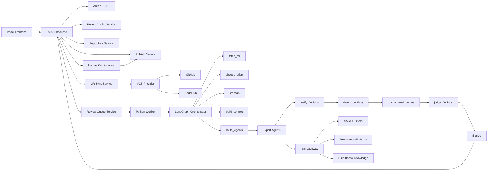

# Production Code Review Platform Enhancement Implementation Plan

> **For Claude:** REQUIRED SUB-SKILL: Use superpowers:executing-plans to implement this plan task-by-task.

**Goal:** 将 Jolt CodeReview 从可运行 MVP 升级为可部署到生产环境使用的企业级代码检视平台。

**Architecture:** 采用前后端分离架构，TS Backend 负责 API、项目配置、VCS 集成、队列与发布，Python Worker 负责 LangGraph 检视编排、专家 Agent、工具调用和结果治理。参考 `/Users/neochen/multi-codereview-agent` 的成熟设计，把单体大文件拆成清晰的 routes / services / repositories / providers / orchestration nodes / tools / agents 模块。

**Tech Stack:** TypeScript, React, Vite, SQLite, Python, LangGraph, MiniMax-M2.7 OpenAI-compatible API, GitHub API, CodeHub API, Semgrep, gitleaks, eslint, ruff, bandit, PMD, Checkstyle, SpotBugs, Tree-sitter, GitNexus.

---

## 1. Scope

本方案重点实现 5 个生产化目标：

1. 专家 Agent 能力生产化：支持可配置职责画像、检视范围、排除范围、markdown 规范文档、工具白名单和输出契约。
2. 静态代码工具体系生产化：使用多种 SAST/linter/report 工具提高检出率，但工具结果只作为候选证据。
3. 后台自动检视队列生产化：系统启动后自动拉取项目下所有仓库待检视 MR，幂等入队，顺序或受控并发执行。
4. 项目级自定义配置生产化：项目隔离仓库、规则、Agent、工具、模型、数据策略、发布策略和队列策略。
5. 代码结构生产化：拆分当前大文件，类和模块职责明确，符合人类阅读习惯，后续扩展不继续堆叠。

## 2. Reference Lessons

参考项目：`/Users/neochen/multi-codereview-agent`

关键经验：

| 能力 | 参考项目做法 | Jolt 增强方向 |
| --- | --- | --- |
| 编排结构 | `orchestrator/graph.py` + `orchestrator/nodes/*` | Python Worker 拆成 LangGraph graph + 独立节点 |
| 专家能力 | `ExpertProfile`、专家规范导出、工具绑定 | Agent 配置表 + markdown 规范 + role profile |
| 工具调用 | `ReviewToolGateway`，专家白名单 + runtime allowlist | 引入 ToolGateway，所有工具调用统一记录 |
| 结果治理 | `detect_conflicts`、`run_targeted_debate`、`judge_and_merge` | 在 Verifier 与 Judge 之间加入冲突检测和定向辩论 |
| 静态工具 | SAST 结果进入 `tool_observations` | 工具输出不直接成为正式 finding |
| 自动队列 | auto review scheduler、review repository | 启动自动同步 + poll + webhook + dead letter |
| 质量治理 | eval、反馈学习、质量画像 | 增加采纳率、误报率、规则健康、Agent 质量报表 |

## 3. Target Architecture



## 4. Target Code Layout

### 4.1 TS Backend

```text
src/backend/
  app.ts
  server.ts
  config/
    app-config.ts
    config-repository.ts
  db/
    connection.ts
    migrations.ts
    seed.ts
  routes/
    auth.routes.ts
    projects.routes.ts
    repositories.routes.ts
    mr-review.routes.ts
    webhooks.routes.ts
    agents.routes.ts
    rules.routes.ts
    quality.routes.ts
  services/
    AuthService.ts
    ProjectService.ts
    RepositoryService.ts
    MrSyncService.ts
    ReviewQueueService.ts
    PublishService.ts
    AgentConfigService.ts
    RuleDocumentService.ts
    ReviewQualityService.ts
    AuditService.ts
  repositories/
    UserRepository.ts
    ProjectRepository.ts
    RepositoryRepository.ts
    MergeRequestRepository.ts
    ReviewJobRepository.ts
    AgentRepository.ts
    RuleDocumentRepository.ts
    AuditRepository.ts
  vcs/
    VcsProvider.ts
    GithubProvider.ts
    CodeHubProvider.ts
    WebhookParser.ts
  middleware/
    auth.ts
    rbac.ts
    error-handler.ts
```

### 4.2 Python Worker

```text
worker/
  main.py
  config.py
  db.py
  queue/
    job_consumer.py
    heartbeat.py
    retry_policy.py
  orchestration/
    graph.py
    state.py
    nodes/
      fetch_mr.py
      choose_effort.py
      prescan.py
      build_context.py
      route_agents.py
      run_experts.py
      verify_findings.py
      detect_conflicts.py
      run_targeted_debate.py
      judge_findings.py
      finalize.py
  agents/
    registry.py
    expert_profile.py
    expert_runner.py
    prompt_builder.py
    output_parser.py
  rules/
    rule_loader.py
    markdown_rule_parser.py
  tools/
    gateway.py
    registry.py
    semgrep_tool.py
    gitleaks_tool.py
    eslint_tool.py
    ruff_tool.py
    bandit_tool.py
    java_report_tool.py
    tree_sitter_tool.py
    gitnexus_tool.py
  trace/
    recorder.py
    artifacts.py
```

## 5. Execution Phases

## Phase P0: Baseline Tests And Safety Nets

### Task P0.1: Add current behavior smoke tests before refactor - Completed

**Status:** Completed on 2026-06-06.

**Verification completed:**
- `npm run verify:production-baseline`
- `npm run verify:design`
- `npm run build`

**Files:**
- Create: `scripts/verify-production-baseline.mjs`
- Modify: `package.json`

**Steps:**

1. Add a script that verifies:
   - `/api/me` works after local login.
   - project list works.
   - repository list works.
   - MR sync endpoint accepts active project.
   - MR list returns items.
   - first MR detail includes `session_logs`.
   - `review-quality/summary` works.
2. Add package script:

```json
{
  "verify:production-baseline": "node scripts/verify-production-baseline.mjs"
}
```

3. Run:

```bash
npm run verify:production-baseline
npm run verify:design
npm run build
```

**Acceptance:**
- All commands pass before structural refactor starts.
- The script prints a compact JSON summary.

## Phase P1: TS Backend Structural Refactor

### Task P1.1: Split database module - Completed

**Status:** Completed on 2026-06-06.

**Verification completed:**
- `npm run build`
- `npm run verify:design`

**Files:**
- Create: `src/backend/db/connection.ts`
- Create: `src/backend/db/migrations.ts`
- Create: `src/backend/db/seed.ts`
- Modify: `src/backend/db.ts`

**Steps:**

1. Move SQLite connection logic from `src/backend/db.ts` to `db/connection.ts`.
2. Move schema creation to `db/migrations.ts`.
3. Move seed data to `db/seed.ts`.
4. Keep `src/backend/db.ts` as a compatibility barrel export during transition.
5. Run:

```bash
npm run build
npm run verify:design
```

**Acceptance:**
- No route behavior changes.
- Existing scripts still import `openDatabase` successfully.

### Task P1.2: Introduce repository classes - Completed

**Files:**
- Create: `src/backend/repositories/ProjectRepository.ts`
- Create: `src/backend/repositories/RepositoryRepository.ts`
- Create: `src/backend/repositories/MergeRequestRepository.ts`
- Create: `src/backend/repositories/ReviewJobRepository.ts`
- Create: `src/backend/repositories/AgentRepository.ts`
- Create: `src/backend/repositories/RuleDocumentRepository.ts`
- Create: `src/backend/repositories/AuditRepository.ts`
- Modify: `src/backend/server.ts`

**Steps:**

1. Extract repeated `all/get/run` SQL into repository classes.
2. Keep method names business-oriented:
   - `listProjectsForUser`
   - `listActiveRepositories`
   - `upsertMergeRequest`
   - `enqueueReviewJob`
   - `supersedeQueuedJobs`
   - `recordAuditLog`
3. Replace direct SQL in `server.ts` gradually.
4. Run:

```bash
npm run build
npm run verify:local
```

**Acceptance:**
- `server.ts` no longer contains bulk SQL for project/repo/MR/job CRUD.
- API output remains unchanged.

**Completed verification:**
- Added repository classes for project, repository, merge request, review job, agent, rule document, and audit access.
- Replaced project/repo/MR/job CRUD SQL in `server.ts` with repository methods.
- `npm run build` passed on 2026-06-06.
- `npm run verify:local` passed on 2026-06-06.

### Task P1.3: Split route files - Completed

**Files:**
- Create: `src/backend/app.ts`
- Create: `src/backend/routes/*.routes.ts`
- Modify: `src/backend/server.ts`

**Steps:**

1. Move route registration into route modules.
2. Keep `server.ts` as process entrypoint only:
   - load config
   - open db
   - create app
   - listen
3. Route modules receive service dependencies explicitly.
4. Run:

```bash
npm run build
npm run smoke
```

**Acceptance:**
- `server.ts` becomes under 120 lines.
- Each route module handles one API domain.

**Completed verification:**
- Added `src/backend/app.ts` for HTTP request matching, body parsing, and JSON responses.
- Reduced `src/backend/server.ts` to process startup only: load config, open DB, create app, listen.
- Split route registration into domain modules under `src/backend/routes/`, including auth, projects, repositories, rules, agents, webhooks, MR review, full-review placeholders, and quality routes.
- `npm run build` passed on 2026-06-06.
- `npm run smoke` passed on 2026-06-06.

## Phase P2: Project-Level Configuration Platform

### Task P2.1: Add project configuration service - Completed

**Files:**
- Create: `src/backend/services/ProjectConfigService.ts`
- Modify: `src/backend/db/migrations.ts`
- Modify: `src/backend/routes/projects.routes.ts`

**Schema additions:**

```sql
CREATE TABLE IF NOT EXISTS project_settings (
  id TEXT PRIMARY KEY,
  project_id TEXT NOT NULL REFERENCES projects(id),
  settings_key TEXT NOT NULL,
  settings_json TEXT NOT NULL DEFAULT '{}',
  updated_at TEXT NOT NULL DEFAULT CURRENT_TIMESTAMP,
  UNIQUE(project_id, settings_key)
);
```

**Settings keys:**
- `llm_policy`
- `review_policy`
- `agent_policy`
- `tool_policy`
- `queue_policy`
- `publish_policy`
- `data_policy`

**Acceptance:**
- `GET /api/projects/:projectId/settings`
- `PATCH /api/projects/:projectId/settings/:key`
- RBAC requires project admin for writes.

**Completed verification:**
- Added `project_settings` SQLite table.
- Added `ProjectConfigService` for allowed settings keys, list, and upsert operations.
- Added project settings read/write routes with project-admin RBAC on writes.
- `npm run build:api` passed on 2026-06-06.
- `GET /api/projects/project_default/settings` returned all allowed settings keys.
- `PATCH /api/projects/project_default/settings/queue_policy` persisted `poll_interval_seconds` and `max_concurrency`.
- `npm run smoke` passed on 2026-06-06.

### Task P2.2: Make config.json runtime defaults only - Completed

**Files:**
- Modify: `src/backend/config.ts`
- Modify: `src/backend/services/ProjectConfigService.ts`
- Modify: `worker/config.py`

**Rules:**
- `config.json` stores deployment defaults and local debug LLM config.
- Project-specific overrides live in SQLite.
- Effective config = deployment defaults + project settings + repository settings.

**Acceptance:**
- Local `config.json` still works.
- Project-level model/tool/queue settings override defaults.

**Completed verification:**
- Added effective config calculation: deployment defaults from `config.json` plus project settings from SQLite.
- Added `GET /api/projects/:projectId/effective-config` for backend/frontend visibility.
- Added `worker/config.py` and switched Python worker config loading to it.
- Worker now computes project effective config per review job and uses it for VCS access, LLM calls, toolchain manifest, and data policy merge.
- Verified project `llm_policy` overrides `default_model` and `default_base_url`.
- Verified project `tool_policy` and `queue_policy` appear in effective config.
- Verified worker effective config loader returns MiniMax-M2.7 and project queue policy from SQLite.
- `npm run build` passed on 2026-06-06.

## Phase P3: Expert Agent Capability Platform

### Task P3.1: Add expert profile model - Completed

**Files:**
- Create: `worker/agents/expert_profile.py`
- Create: `worker/agents/registry.py`
- Modify: `src/backend/db/migrations.ts`
- Modify: `src/backend/services/AgentConfigService.ts`

**Schema additions:**

```sql
CREATE TABLE IF NOT EXISTS expert_profiles (
  id TEXT PRIMARY KEY,
  project_id TEXT NOT NULL REFERENCES projects(id),
  agent_key TEXT NOT NULL,
  display_name TEXT NOT NULL,
  role_profile TEXT NOT NULL,
  responsibility_scope TEXT NOT NULL,
  excluded_scope TEXT NOT NULL DEFAULT '',
  enabled INTEGER NOT NULL DEFAULT 1,
  min_confidence REAL NOT NULL DEFAULT 0.75,
  max_findings INTEGER NOT NULL DEFAULT 8,
  max_llm_calls INTEGER NOT NULL DEFAULT 4,
  max_tool_calls INTEGER NOT NULL DEFAULT 8,
  output_schema_version TEXT NOT NULL DEFAULT 'finding_v1',
  UNIQUE(project_id, agent_key)
);
```

**Acceptance:**
- Preseed agents:
  - security_agent
  - performance_agent
  - coding_agent
  - ddd_agent
  - frontend_agent
  - test_agent
  - redis_agent
  - backend_agent
- Each agent has role profile, scope, excluded scope.

**Completed verification:**
- Added `expert_profiles` SQLite table.
- Added `AgentConfigService` and `GET /api/projects/:projectId/expert-profiles`.
- Seeded expert profiles for security, performance, coding, DDD, frontend, test, Redis, and backend experts.
- `GET /api/projects/project_default/expert-profiles` returned 8 profiles, each with role profile, responsibility scope, and excluded scope.
- `GET /api/projects/project_default/agents` includes joined expert profile fields for configured agents.
- Added worker `agents/expert_profile.py` and `agents/registry.py`.
- Worker registry loads `expert_profiles` and respects explicitly disabled legacy `agent_configs`.
- `npm run verify:agents` passed on 2026-06-06.
- Python `py_compile` passed for worker agent modules on 2026-06-06.
- `npm run build` passed on 2026-06-06.

### Task P3.2: Add markdown rule document binding - Completed

**Files:**
- Create: `worker/rules/markdown_rule_parser.py`
- Create: `worker/rules/rule_loader.py`
- Modify: `src/backend/db/migrations.ts`
- Modify: `src/backend/routes/rules.routes.ts`

**Schema additions:**

```sql
CREATE TABLE IF NOT EXISTS rule_documents (
  id TEXT PRIMARY KEY,
  project_id TEXT NOT NULL REFERENCES projects(id),
  name TEXT NOT NULL,
  doc_type TEXT NOT NULL DEFAULT 'markdown',
  content TEXT NOT NULL,
  version TEXT NOT NULL,
  status TEXT NOT NULL DEFAULT 'draft',
  created_at TEXT NOT NULL DEFAULT CURRENT_TIMESTAMP
);

CREATE TABLE IF NOT EXISTS expert_rule_bindings (
  id TEXT PRIMARY KEY,
  project_id TEXT NOT NULL REFERENCES projects(id),
  agent_key TEXT NOT NULL,
  rule_document_id TEXT NOT NULL REFERENCES rule_documents(id),
  priority INTEGER NOT NULL DEFAULT 100,
  UNIQUE(project_id, agent_key, rule_document_id)
);
```

**Rule markdown format:**

```markdown
# Security Rules

## SEC-001 权限校验
- severity: high
- applies_to: backend/api/**
- check: 所有项目管理接口必须校验 project_admin
- evidence_required: route, permission check, changed line
```

**Acceptance:**
- Agent prompt contains:
  - role profile checks
  - each bound rule item
  - instruction to return union of both result sets
- Agent output includes `covered_rules` and `skipped_rules`.

**Completed verification:**
- Added `rule_documents` and `expert_rule_bindings` SQLite tables.
- Added `covered_rules_json` and `skipped_rules_json` columns to `review_findings`.
- Seeded one active Markdown rule document per expert profile and bound each document to its expert.
- Added rule document and expert-rule-binding APIs under project rules routes.
- Added `worker/rules/markdown_rule_parser.py` and `worker/rules/rule_loader.py`.
- Worker loads bound Markdown rules per agent and adds them to agent prompt as `bound_markdown_rules`.
- Prompt instructs the model to return union of profile checks and bound rule checks, with `covered_rules` and `skipped_rules`.
- Parser preserves `covered_rules` and `skipped_rules`; judge persists them to SQLite.
- Verified security agent prompt includes 2 bound rules and parsed covered/skipped rule IDs.
- `npm run build` and `npm run smoke` passed on 2026-06-06.

### Task P3.3: Add expert tool binding - Completed

**Files:**
- Create: `src/backend/services/AgentToolBindingService.ts`
- Create: `worker/tools/gateway.py`
- Modify: `src/backend/db/migrations.ts`

**Schema additions:**

```sql
CREATE TABLE IF NOT EXISTS expert_tool_bindings (
  id TEXT PRIMARY KEY,
  project_id TEXT NOT NULL REFERENCES projects(id),
  agent_key TEXT NOT NULL,
  tool_name TEXT NOT NULL,
  permission_level TEXT NOT NULL DEFAULT 'read_only',
  max_calls INTEGER NOT NULL DEFAULT 5,
  enabled INTEGER NOT NULL DEFAULT 1,
  UNIQUE(project_id, agent_key, tool_name)
);
```

**Acceptance:**
- ToolGateway rejects tools not enabled by both:
  - project tool policy
  - expert tool binding
- Every tool invocation writes `tool_call_records`.

**Completed verification:**
- Added `expert_tool_bindings` SQLite table.
- Added `AgentToolBindingService`.
- Added `GET/POST /api/projects/:projectId/expert-tool-bindings`.
- Seeded default `static.heuristic_prescan` bindings for configured experts and `github.list_pull_files` for security agent.
- Added `worker/tools/gateway.py`.
- Expert agent static heuristic tool execution now checks `ToolGateway` before running.
- Allowed tool calls and policy rejections are recorded through `recorder.tool_call`, preserving `tool_call_records`.
- Verified gateway allows bound `static.heuristic_prescan`.
- Verified gateway rejects unbound `shell.exec`.
- Verified project `tool_policy.disabled_tools` rejects an otherwise bound tool.
- `npm run build` and `npm run smoke` passed on 2026-06-06.

## Phase P4: Static Tool System

### Task P4.1: Build normalized tool observation model - Completed

**Files:**
- Create: `worker/tools/registry.py`
- Create: `worker/tools/models.py`
- Modify: `src/backend/db/migrations.ts`

**Schema additions:**

```sql
CREATE TABLE IF NOT EXISTS tool_observations (
  id TEXT PRIMARY KEY,
  review_run_id TEXT NOT NULL REFERENCES review_runs(id),
  tool_name TEXT NOT NULL,
  rule_id TEXT,
  severity TEXT,
  confidence REAL NOT NULL DEFAULT 0.5,
  file_path TEXT NOT NULL,
  line_start INTEGER,
  line_end INTEGER,
  message TEXT NOT NULL,
  raw_artifact_id TEXT,
  adopted_by_agent TEXT,
  adoption_state TEXT NOT NULL DEFAULT 'candidate',
  created_at TEXT NOT NULL DEFAULT CURRENT_TIMESTAMP
);
```

**Acceptance:**
- Tool outputs are never inserted directly into `review_findings`.
- Agent receives summarized `tool_observations`.
- Judge can see whether a finding was cross-validated by a tool.

**Completed verification:**
- Added `tool_observations` SQLite table.
- Added worker `tools/models.py` and `tools/registry.py`.
- External static tool findings are converted into `ToolObservation` records during prescan.
- Prescan persists observations and passes summarized `tool_observations` into agent prompts.
- `all_findings` no longer starts with external tool findings; final findings come from expert/static heuristic/LLM judgment flow.
- Verifier and judge trace events include `tool_observation_count`.
- MR detail API returns `tool_observations`.
- Verified `tool_observations` table exists and observation conversion outputs normalized fields.
- `npm run build` and `npm run smoke` passed on 2026-06-06.

### Task P4.2: Add tool wrappers - Completed

**Files:**
- Create:
  - `worker/tools/semgrep_tool.py`
  - `worker/tools/gitleaks_tool.py`
  - `worker/tools/eslint_tool.py`
  - `worker/tools/ruff_tool.py`
  - `worker/tools/bandit_tool.py`
  - `worker/tools/java_report_tool.py`

**Tools:**
- Semgrep
- gitleaks
- eslint
- ruff
- bandit
- PMD report parser
- Checkstyle report parser
- SpotBugs report parser
- JaCoCo report parser

**Acceptance:**
- Missing tools do not fail the review.
- Missing tools are recorded in `toolchain_manifest`.
- Tool status supports `available`, `missing`, `disabled`, `requires_report`, `failed`.

**Completed verification:**
- Added static tool wrapper modules for semgrep, gitleaks, eslint, ruff, bandit, and Java report parsing.
- Java report wrapper supports PMD, Checkstyle, SpotBugs, and JaCoCo report parser entrypoints.
- Updated worker static command status from `not_available` to `missing`.
- Added bandit to external static prescan toolchain with skip/missing behavior.
- Verified wrapper probes return `available` or `missing`.
- Verified missing Java report returns `requires_report`.
- `npm run build` and `npm run smoke` passed on 2026-06-06.

### Task P4.3: Add code graph and impact tools - Completed

**Files:**
- Create:
  - `worker/tools/tree_sitter_tool.py`
  - `worker/tools/gitnexus_tool.py`
  - `worker/orchestration/nodes/build_context.py`

**Acceptance:**
- MVP fallback still uses diff slices.
- If Tree-sitter is available, context includes functions/classes/imports/callers/callees.
- If GitNexus is available, context includes impact paths.
- Context artifacts are saved to sandbox.

**Completed verification:**
- Added `worker/tools/tree_sitter_tool.py`.
- Added `worker/tools/gitnexus_tool.py`.
- Added `worker/orchestration/nodes/build_context.py`.
- Existing context still keeps diff slices and lightweight symbol summaries as fallback.
- `build_code_context_snapshot` now includes Tree-sitter status with functions/classes/imports/callers/callees fields.
- `build_code_context_snapshot` now includes GitNexus status with `impact_paths`.
- Context artifacts continue to be written to sandbox through `code_context_snapshot.json`.
- Verified build context node returns Tree-sitter/GitNexus status and impact fields.
- `npm run build` and `npm run smoke` passed on 2026-06-06.

## Phase P5: Automatic Review Queue

### Task P5.1: Extract MR sync service - Completed

**Files:**
- Create: `src/backend/services/MrSyncService.ts`
- Create: `src/backend/vcs/VcsProvider.ts`
- Create: `src/backend/vcs/GithubProvider.ts`
- Create: `src/backend/vcs/CodeHubProvider.ts`
- Modify: `src/backend/routes/mr-review.routes.ts`
- Modify: `src/backend/routes/webhooks.routes.ts`

**Acceptance:**
- GitHub and CodeHub have the same normalized MR shape.
- Sync logic does not live in route handlers.
- Webhook and manual sync reuse the same service.

**Completed verification:**
- Added `src/backend/vcs/VcsProvider.ts` with normalized MR shape.
- Added `GithubProvider` and `CodeHubProvider`.
- Added `MrSyncService` for provider sync, normalized MR upsert, queued job enqueue, and queued-job supersede.
- Manual project sync now delegates to `MrSyncService.syncProject`.
- GitHub/CodeHub webhook update paths now reuse `MrSyncService.upsertAndEnqueue`.
- `npm run build`, `npm run smoke`, and `npm run verify:codehub` passed on 2026-06-06.

### Task P5.2: Extract review queue service - Completed

**Files:**
- Create: `src/backend/services/ReviewQueueService.ts`
- Modify: `src/backend/repositories/ReviewJobRepository.ts`
- Modify: `worker/queue/job_consumer.py`

**Queue rules:**
- Unique key: `(merge_request_id, head_sha)`.
- New head supersedes old queued job.
- Closed/merged MR cancels queued job.
- Worker updates heartbeat every 10 seconds.
- Jobs without heartbeat for 60 seconds can be reclaimed.
- Retry with exponential backoff.
- Dead-letter after max attempts.

**Acceptance:**
- Add verify script `scripts/verify-queue-reliability.mjs`.
- Script covers idempotent enqueue, supersede, retry, dead-letter.

**Completed verification:**
- Added `src/backend/services/ReviewQueueService.ts` and routed MR sync, manual enqueue, retry, and webhook cancellation through it.
- Queue service now centralizes idempotent enqueue, enqueue-or-reset, supersede, cancel, retry, dead-letter, and stale reclaim operations.
- Added `worker/queue/job_consumer.py` with heartbeat, reclaim, retry, and backoff policy constants.
- Worker now starts a 10-second heartbeat loop for active jobs and reclaims stale fetching/pre_scanning/reviewing/judging jobs after 60 seconds.
- Added `scripts/verify-queue-reliability.mjs` and `npm run verify:queue-reliability`.
- `npm run verify:queue-reliability` passed on 2026-06-07 and covered idempotent enqueue, supersede, cancel, retry, dead-letter, and stale reclaim.
- Python `py_compile` passed for `worker/review_worker.py` and queue modules on 2026-06-07.
- `npm run smoke` and `npm run build` passed on 2026-06-07.

### Task P5.3: Add startup automatic sync scheduler - Completed

**Files:**
- Create: `src/backend/services/MrAutoSyncScheduler.ts`
- Modify: `src/backend/app.ts`
- Modify: `scripts/start-all.mjs`

**Behavior:**
- On API start, load active projects and active repositories.
- Immediately sync open MRs once.
- Continue polling by project `queue_policy.poll_interval_seconds`.
- Never start duplicate scheduler in test mode.

**Acceptance:**
- Starting the system automatically pulls active project MRs.
- Frontend MR queue updates without manual refresh after startup.

**Completed verification:**
- Added `src/backend/services/MrAutoSyncScheduler.ts`.
- API startup now creates and starts the scheduler unless `NODE_ENV=test` or `JOLT_AUTO_SYNC_DISABLED` disables it.
- Scheduler loads all projects, immediately syncs each project once, schedules per-project polling from `queue_policy.poll_interval_seconds`, and avoids duplicate in-flight sync for the same project.
- `scripts/start-all.mjs` no longer starts the external Poller by default, preventing duplicate sync loops; legacy poller can still be enabled with `JOLT_START_EXTERNAL_POLLER=1`.
- Added `scripts/verify-auto-sync-scheduler.mjs` and `npm run verify:auto-sync`.
- `npm run verify:auto-sync` passed on 2026-06-07 and verified immediate sync, duplicate-start protection, per-project timers, stop cleanup, and test/disabled-mode behavior.
- A temporary API start on `127.0.0.1:18011` printed `MR auto-sync scheduler started` on 2026-06-07.
- `npm run build`, `npm run smoke`, and `npm run verify:e2e` passed on 2026-06-07.

## Phase P6: Python Worker Orchestration Refactor

### Task P6.1: Move LangGraph nodes out of `review_worker.py` - Completed

**Files:**
- Create: `worker/orchestration/graph.py`
- Create: `worker/orchestration/state.py`
- Create: `worker/orchestration/nodes/*.py`
- Modify: `worker/review_worker.py`

**Node order:**

```text
fetch_mr
choose_effort
prescan
build_context
route_agents
run_experts
verify_findings
detect_conflicts
run_targeted_debate
judge_findings
finalize
```

**Acceptance:**
- `worker/review_worker.py` only parses CLI and starts queue consumer.
- Each node has one responsibility and isolated tests.

**Completed on 2026-06-07:**
- Added `worker/orchestration/graph.py` and moved LangGraph invocation/fallback logic out of the worker entrypoint.
- Added `worker/orchestration/state.py` with executed and target graph node orders.
- Moved the large runtime body into `worker/review_runtime.py`.
- Reduced `worker/review_worker.py` to a thin 8-line entrypoint that delegates to runtime `main`.
- Extracted `fetch_mr`, `choose_effort`, `prescan`, `build_context`, `route_agents`, `run_experts`, `verify_findings`, `detect_conflicts`, `run_targeted_debate`, `judge_findings`, and `finalize` into `worker/orchestration/nodes/*.py`.
- Updated the graph execution order to `fetch_mr -> choose_effort -> prescan -> build_context -> route_agents -> run_experts -> verify_findings -> detect_conflicts -> run_targeted_debate -> judge_findings -> finalize`.
- `worker/review_runtime.py` now wires node factories and queue processing; it no longer contains inline LangGraph node closures.
- `scripts/verify_worker_orchestration_nodes.py` now asserts required node files exist, executed graph nodes match target graph nodes, and `review_runtime.py` has no inline node definitions.
- `.venv/bin/python -m py_compile worker/review_worker.py worker/review_runtime.py worker/orchestration/graph.py worker/orchestration/state.py worker/orchestration/nodes/*.py` passed.
- `npm run verify:worker-orchestration`, `npm run verify:e2e`, `npm run build`, and `npm run smoke` passed on 2026-06-07.

### Task P6.2: Add conflict detection and targeted debate - Completed

**Files:**
- Create: `worker/orchestration/nodes/detect_conflicts.py`
- Create: `worker/orchestration/nodes/run_targeted_debate.py`

**Conflict cases:**
- Two agents report same location with different severity.
- One agent reports issue, another marks no issue.
- Tool observation supports a finding but Agent confidence is low.
- High severity finding lacks direct evidence.

**Acceptance:**
- Debate only runs for conflicts, not every finding.
- Debate transcript is stored in `agent_messages`.
- Judge sees debate result.

**Completed verification:**
- Added `worker/orchestration/nodes/detect_conflicts.py`.
- Added `worker/orchestration/nodes/run_targeted_debate.py`.
- Worker graph now runs `detect_conflicts` and `run_targeted_debate` between Verifier and Judge.
- Conflict detector covers severity disagreement, issue-vs-no-issue, tool-supported low confidence, and high severity with weak evidence.
- Targeted debate only generates transcripts for detected conflicts and stores them through `recorder.message` in `agent_messages`.
- Judge receives conflict and debate transcript counts in state and records them in trace payload.
- Added `scripts/verify_worker_orchestration_nodes.py` and `npm run verify:worker-orchestration`.
- `npm run verify:worker-orchestration` passed on 2026-06-07 and covered all conflict types plus targeted debate transcripts.
- `npm run verify:e2e` passed on 2026-06-07 with graph nodes including `detect_conflicts` and `run_targeted_debate`.

### Task P6.3: Upgrade Judge - Completed

**Files:**
- Create: `worker/orchestration/nodes/judge_findings.py`
- Create: `worker/orchestration/nodes/verify_findings.py`

**Judge responsibilities:**
- Dedupe by file, line, title, rule ref, semantic hash.
- Apply project max findings.
- Calibrate severity.
- Apply confidence threshold.
- Preserve rejected reason.
- Mark selected findings for human confirmation.

**Acceptance:**
- Rejected candidates are visible in process logs.
- Final findings are stable and deterministic for the same input.

**Completed verification:**
- Added `worker/orchestration/nodes/verify_findings.py`.
- Added `worker/orchestration/nodes/judge_findings.py`.
- Verifier now returns accepted and rejected candidates, preserving rejection reasons such as `below_confidence`, `file_not_found`, `suppressed_by_feedback`, and `schema_invalid`.
- Judge now performs stable composite dedupe by file, line, title, covered rules, and semantic hash.
- Judge applies max findings, selected-state threshold, and severity calibration for high-severity weak-evidence conflicts.
- Judge records rejected candidates in process logs through `finding_dropped` trace events.
- `npm run verify:worker-orchestration` passed on 2026-06-07 and covered verifier rejection, Judge max findings, severity calibration, and selected-state marking.
- `npm run verify:e2e` passed on 2026-06-07 after Judge integration.

## Phase P7: Observability And Quality Governance

### Task P7.1: Add production observability APIs - Completed

**Files:**
- Create: `src/backend/routes/observability.routes.ts`
- Create: `src/backend/services/ObservabilityService.ts`

**APIs:**
- `GET /api/projects/:projectId/queue/summary`
- `GET /api/projects/:projectId/toolchain/status`
- `GET /api/projects/:projectId/agents/quality`
- `GET /api/projects/:projectId/review-quality/summary`

**Acceptance:**
- Frontend can show queue length, failure rate, avg review duration, tool availability.

**Completed verification:**
- Added `src/backend/services/ObservabilityService.ts`.
- Added `src/backend/routes/observability.routes.ts`.
- Added APIs:
  - `GET /api/projects/:projectId/queue/summary`
  - `GET /api/projects/:projectId/toolchain/status`
  - `GET /api/projects/:projectId/agents/quality`
- Existing `GET /api/projects/:projectId/review-quality/summary` remains available through quality routes.
- Added `scripts/verify-observability.mjs` and `npm run verify:observability`.
- `npm run verify:observability` passed on 2026-06-07 and verified queue status counts, running jobs, dead-letter count, latest toolchain status, Agent quality metrics, and review quality summary.
- `npm run smoke` and `npm run build` passed on 2026-06-07.

### Task P7.2: Add feedback learning loop - Completed

**Files:**
- Create: `src/backend/services/FeedbackLearningService.ts`
- Modify: `worker/orchestration/nodes/judge_findings.py`

**Behavior:**
- User marks false positive.
- Similar future finding gets confidence penalty.
- User publishes finding.
- Similar future finding gets confidence boost.

**Acceptance:**
- Feedback affects Judge only, not raw Agent output.
- Audit log records feedback impact.

**Completed verification:**
- Added `src/backend/services/FeedbackLearningService.ts`.
- Feedback route now records feedback through `FeedbackLearningService`.
- Publish path now records `accepted` feedback for published or dry-run-confirmed findings.
- Worker now loads project-level feedback from the last 90 days before Verifier/Judge.
- `false_positive` and `suppress_rule` feedback suppress similar future findings at Verifier.
- `accepted` and `published` feedback apply a small confidence boost before Verifier, preserving Agent raw output and applying feedback only in governance.
- Feedback boost events are recorded as `finding_feedback_boosted` trace events; feedback actions continue to write audit logs through existing route audit calls.
- `npm run verify:e2e` passed on 2026-06-07 after feedback learning integration.
- SQLite verification confirmed `user_feedback` contains both `accepted` and `false_positive` records after publish/feedback flows.
- `npm run build`, `npm run smoke`, and `npm run verify:observability` passed on 2026-06-07.

## Phase P8: Frontend Production Surfaces

### Task P8.1: Upgrade Agent configuration page

**Files:**
- Modify: `src/frontend/main.tsx`
- Modify: `src/frontend/styles.css`

**UI:**
- Agent enable/disable.
- Role profile editor.
- Responsibility scope editor.
- Excluded scope editor.
- Bound markdown rules.
- Bound tools.
- Thresholds and max calls.

**Acceptance:**
- Project admin can configure Agent without editing files.
- Non-admin can view but not edit.

**Status:** Completed on 2026-06-07.

**Verification:**
- `npm run build` passed.
- `npm run smoke` passed.
- Desktop Playwright check at `1440x900` confirmed the Agent page shows role profile, responsibility scope, excluded scope, bound markdown rules, bound tools, thresholds, max findings, max LLM calls, and max tool calls with no horizontal overflow and no console errors.
- Backend `PATCH /api/projects/:projectId/expert-profiles/:agentKey` remains protected by project write permissions; frontend disables Agent editing for non-admin project roles.

### Task P8.2: Add toolchain status page

**Files:**
- Modify: `src/frontend/main.tsx`
- Modify: `src/frontend/styles.css`

**UI:**
- Tool name.
- Status.
- Version.
- Last run.
- Failure reason.
- Required action.

**Acceptance:**
- Missing tools are obvious before running production reviews.

**Status:** Completed on 2026-06-07.

**Verification:**
- `npm run build` passed.
- `npm run smoke` passed.
- Desktop Playwright check at `1440x900` confirmed the toolchain page shows latest run, manifest summary, tool policy, and tool status table with no horizontal overflow and no console errors.

### Task P8.3: Add queue operations page

**Files:**
- Modify: `src/frontend/main.tsx`
- Modify: `src/frontend/styles.css`

**UI:**
- Queue length by status.
- Running jobs.
- Failed/dead-letter jobs.
- Retry button.
- Superseded jobs.

**Acceptance:**
- Operators can diagnose stuck jobs from UI.

**Status:** Completed on 2026-06-07.

**Verification:**
- `npm run build` passed.
- `npm run smoke` passed.
- Desktop Playwright check at `1440x900` confirmed the queue operations page shows queue health, status counts, running jobs table, dead-letter section, and retry controls with no horizontal overflow and no console errors.

## 6. Production Acceptance Criteria

平台达到生产可用，需要满足：

| Area | Acceptance |
| --- | --- |
| Agent | 每个专家可配置画像、范围、规范、工具、阈值 |
| Tools | 至少 Semgrep、gitleaks、eslint、ruff、bandit 可用，Java 报告解析预留 |
| Queue | 启动自动同步、webhook、poll、幂等、retry、dead-letter、heartbeat |
| Project | 项目隔离配置生效，仓库/Agent/规则/工具/模型互不串扰 |
| Code Structure | `server.ts` 和 `review_worker.py` 不再承载核心业务大杂烩 |
| Observability | 可查看队列、Agent、工具、LLM、质量摘要 |
| Safety | AI 不自动发布，必须用户确认 |
| Audit | 配置变更、工具调用、LLM 调用、发布、反馈均可追踪 |

## 7. Verification Command Set

每个阶段至少运行：

```bash
npm run build
npm run verify:design
npm run verify:agents
npm run verify:e2e
npm run verify:codehub
npm run verify:local
```

新增生产化验证：

```bash
npm run verify:production-baseline
npm run verify:queue-reliability
npm run verify:toolchain
npm run verify:agent-config
```

Python Worker 拆分后增加：

```bash
python3 -m py_compile worker/**/*.py
python3 -m pytest worker/tests
```

## 8. Implementation Order Recommendation

推荐顺序：

1. P0 baseline tests。
2. P1 TS Backend structural refactor。
3. P6 Python Worker orchestration refactor。
4. P2 project-level configuration。
5. P3 expert Agent platform。
6. P4 static tool system。
7. P5 automatic review queue。
8. P7 observability and quality governance。
9. P8 frontend production surfaces。

原因：先拆结构，再加能力。否则专家、工具、队列继续写进大文件，会让后续维护成本迅速失控。

## 9. Risks And Controls

| Risk | Control |
| --- | --- |
| 结构重构破坏现有流程 | P0 baseline + 每阶段 build/e2e/codehub/local |
| 静态工具误报污染结果 | tool_observations 只作为候选证据，必须过 Agent/Verifier/Judge |
| Agent 互相重复检视 | 每个 Agent 定义 responsibility_scope 和 excluded_scope |
| 队列重复执行 | `(merge_request_id, head_sha)` 唯一键 |
| worker 卡死 | heartbeat + reclaim + dead-letter |
| 项目配置串扰 | 所有配置表必须带 project_id |
| token 泄露 | secret 只从 env/config ref 读取，不写 trace 原文 |
| 大 diff 成本失控 | budget + diff slicing + effort degrade |

## 10. Done Definition

完成本方案后，系统应具备以下生产能力：

1. 系统启动后自动同步项目下所有活跃仓库待检视 MR。
2. 每个 MR 按队列策略自动进入后台检视流程。
3. 专家 Agent 可由项目管理员配置角色画像、职责范围、规范文档和工具权限。
4. 多种静态工具产出候选证据，提高检出率但不直接生成最终意见。
5. 检视过程完整记录 Agent 对话、工具调用、LLM 调用、MCP 调用和 artifacts。
6. 用户在前端确认后才发布意见到 GitHub / CodeHub。
7. 代码结构清晰，新增 Agent、工具、VCS 平台或全量检视能力时不需要修改单个巨型文件。
