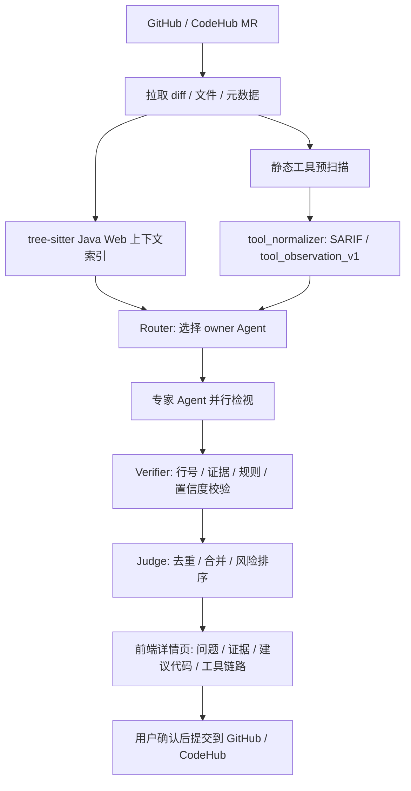

# Java Web 项目 AI 代码检视质量优化实施方案

日期：2026-06-07

适用范围：Jolt CodeReview 面向 Java / Spring Web 项目的 MR 检视能力升级。

关联文档：

- `docs/plans/2026-06-07-java-web-static-tooling.md`
- `docs/plans/2026-06-06-ai-code-review-platform-design.md`
- `docs/plans/2026-06-06-design-improvements.md`

## 1. 目标

把当前通用 AI MR 检视平台升级为面向 Java Spring 团队可生产使用的高质量代码检视平台。核心目标不是让大模型独立判断所有问题，而是让确定性工具、结构化上下文和专家 Agent 分工协作。

目标指标：

| 指标 | 目标 |
| --- | --- |
| Java Web finding 工具证据覆盖率 | >= 90% |
| LLM token 成本 | 相比纯 LLM 检视下降 >= 60% |
| 单 MR standard 检视耗时 | <= 90s |
| 注解、路由、Mapper 定位准确率 | >= 99% |
| 同一问题跨工具重复评论 | <= 1 条 |
| DDL 破坏性变更检出率 | 100% |
| 高危 CVE 漏报率 | <= 5% |
| 每条最终 finding | 必须包含精确文件、行号、证据、建议修改代码 |

## 2. 总体原则

1. 确定性问题由确定性工具先发现。
2. LLM Agent 只处理业务语义判断、跨工具降噪、修复建议和解释。
3. 每个专家 Agent 必须绑定自己的 Markdown 规范文档。
4. 专家职责必须互斥，避免多个 Agent 对同一问题重复评论。
5. 工具输出必须统一成 SARIF 或平台 `tool_observation_v1`。
6. 最终 finding 必须经过 Verifier 和 Judge。
7. 发布到 GitHub / CodeHub 必须由用户人工确认。

## 3. 推荐架构



## 4. Java Web 工具链

| 层级 | 工具 | 用途 | 默认策略 |
| --- | --- | --- | --- |
| 语法上下文 | tree-sitter-java / xml / yaml | 路由表、注解、Bean、Mapper、行号定位 | P0 必须接入 |
| Java 安全 | Semgrep Java / Spring / OWASP | 注入、SSRF、JWT、危险 API | P0 必须接入 |
| 字节码 | SpotBugs + FindSecBugs + sb-contrib | NPE、资源泄漏、线程、安全坏味道 | P1 接入 |
| 源码规范 | PMD + 阿里 P3C | 复杂度、规范、Spring 坏味道 | P1 接入 |
| 基线规范 | Checkstyle | import、命名、格式健康度 | 默认只做健康信号 |
| 依赖 | Dependency-Check / osv-scanner | CVE、依赖风险 | pom/gradle 变更强制 |
| 密钥 | gitleaks / TruffleHog | secrets、云厂商 AK/SK、JDBC 密码 | 默认开启 |
| 配置 | Trivy config / KICS | Docker、K8s、Spring 配置风险 | 配置变更触发 |
| 测试 | JaCoCo | 新增代码覆盖率 | CI 外部报告接入 |
| 架构 | ArchUnit | 分层、依赖方向、上下文边界 | CI 外部报告接入 |
| 数据库 | Flyway / Liquibase diff | DDL 兼容性、回滚风险 | migration 变更强制 |
| API 合约 | openapi-diff / oasdiff | breaking change | API 变更触发 |
| 深度安全 | CodeQL | 跨过程污点分析 | deep 等级异步触发 |

## 5. 专家 Agent 与规范绑定

每个专家 Agent 必须绑定一个独立 Markdown 规范文档。规范不是普通提示词，而是结构化代码规范，至少包含：

- 规范说明
- 检查点
- 如何检查
- 正例
- 反例
- 工具证据
- 输出要求

| Agent | 绑定规范文档 | 唯一职责 |
| --- | --- | --- |
| Security Agent | `agent-skills/security-review/JAVA_WEB_STANDARD.md` | 鉴权、越权、注入、敏感信息、安全配置、依赖安全 |
| Spring Backend Agent | `agent-skills/backend-review/JAVA_WEB_STANDARD.md` | Controller、Service、事务、异常、幂等、接口契约 |
| General Coding Agent | `agent-skills/coding-review/JAVA_WEB_STANDARD.md` | 空值、边界、异常、状态一致性、资源释放、可维护性 |
| DDD Design Agent | `agent-skills/ddd-design-review/JAVA_WEB_STANDARD.md` | 聚合、实体、值对象、领域服务、上下文边界 |
| Performance Agent | `agent-skills/performance-review/JAVA_WEB_STANDARD.md` | 查询、IO、批处理、并发、超时、重试、资源消耗 |
| Redis Agent | `agent-skills/redis-review/JAVA_WEB_STANDARD.md` | key、TTL、锁、缓存一致性、危险命令、降级 |
| Test Agent | `agent-skills/test-review/JAVA_WEB_STANDARD.md` | JaCoCo、新增逻辑覆盖、断言、边界、回归 |
| Frontend Agent | `agent-skills/frontend-review/JAVA_WEB_STANDARD.md` | 前端状态、表单、异步、可访问性、浏览器安全 |
| Dependency Agent | `agent-skills/dependency-review/JAVA_WEB_STANDARD.md` | CVE、license、版本冲突、大版本升级 |
| Database Agent | `agent-skills/database-review/JAVA_WEB_STANDARD.md` | Flyway/Liquibase、DDL 兼容、索引、回滚 |

## 6. Agent 执行契约

每个专家 Agent 的检视必须执行两部分，并取并集：

1. 按绑定规范文档逐条检查。
2. 按专家角色画像做自由检视。

输出 finding 必须满足：

```json
{
  "severity": "high",
  "confidence": 0.88,
  "file_path": "src/main/java/com/acme/OrderController.java",
  "line_start": 42,
  "line_end": 45,
  "title": "新增订单接口缺少权限校验",
  "problem_description": "该接口可以修改订单状态，但未校验当前用户是否拥有该订单权限。",
  "recommendation": "在进入业务逻辑前校验订单归属和操作权限。",
  "suggested_code": "orderPermissionService.requireCanUpdate(currentUserId, orderId);",
  "evidence": "POST /orders/{id}/status 直接调用 orderService.updateStatus。",
  "covered_rules": ["SEC-AUTHZ-001"],
  "tool_refs": ["semgrep:java.spring.missing-authorization"]
}
```

缺少精确行号、证据、建议代码的 finding 必须被 Verifier 丢弃。

## 7. Router 分工策略

Router 先按文件路径、工具命中和变更类型分配 owner Agent。

| 变更类型 | owner Agent | reviewer Agent |
| --- | --- | --- |
| `Controller.java`、路由、鉴权注解 | Security 或 Spring Backend | Test |
| `Service.java`、事务、状态流转 | Spring Backend | DDD、Test |
| `domain/**`、`aggregate/**` | DDD | Spring Backend |
| `pom.xml`、`build.gradle` | Dependency | Security |
| `db/migration/**` | Database | Spring Backend |
| RedisTemplate、Redisson、cache 注解 | Redis | Performance、Test |
| 大批量查询、分页、异步任务 | Performance | Spring Backend |
| `*.tsx`、`frontend/**` | Frontend | Test |
| 新增大量业务分支 | Test | owner 对应领域专家 |

owner Agent 可以产出 finding；reviewer Agent 默认只对已有候选投票或补充证据，避免重复生成。

## 8. 分阶段实施计划

### P0: 2 周内必须完成

1. 新增专家规范文档并绑定到 Agent。
2. 接入 tree-sitter Java / XML / YAML，替换正则符号摘要。
3. Semgrep 启用 Java / Spring / OWASP 规则包。
4. 强化 finding schema：精确 `line_start` / `line_end` / `suggested_code`。
5. 新增 `tool_normalizer.py`，统一工具输出。
6. 前端详情页展示工具证据、规范 rule_id、建议代码。

### P1: 3-6 周

1. 接入 SpotBugs + FindSecBugs。
2. 接入 PMD + 阿里 P3C。
3. gitleaks 中文云厂商和 Spring 配置规则强化。
4. 新增 Dependency Agent 和 Database Agent。
5. 新增 external reports API，接收 JaCoCo、ArchUnit、Flyway、OpenAPI diff。

### P2: 7-10 周

1. 接入 Dependency-Check / osv-scanner / License Finder。
2. 接入 Trivy config / KICS。
3. 接入 Error Prone / NullAway CI 报告。
4. 跨工具去重和 confidence 加权。
5. 项目级规则健康度报表和误报反馈学习。

### P3: 10 周后

1. CodeQL deep 安全异步分析。
2. Java Web benchmark 评测集。
3. Agent 质量报表：采纳率、误报率、漏报率、token 成本。
4. 组织级规范继承和项目级覆写。

## 9. 数据与可观测性

每次检视必须记录：

- 工具版本和规则版本
- 每个工具的原始报告 artifact
- 每个 Agent 加载的规范文档版本
- Agent 对话摘要
- 工具调用参数和结果摘要
- LLM 调用模型、token、耗时
- Verifier 丢弃原因
- Judge 合并链路
- 用户确认、误报、发布记录

## 10. 验收清单

- [ ] 每个 Agent 都有独立 `JAVA_WEB_STANDARD.md`。
- [ ] 每个规范文档包含说明、检查点、如何检查、正例、反例。
- [ ] Agent prompt 会加载绑定规范，并逐条检查。
- [ ] finding 必须包含精确行号和建议代码。
- [ ] 工具结果进入 `tool_observations`，不直接绕过 Agent 发布。
- [ ] 前端详情页展示规则、证据、建议代码和工具链路。
- [ ] GitHub / CodeHub 评论中包含精确位置和建议代码。
- [ ] Java demo MR 能跑出安全、Redis、性能、DDD、测试等专家结果。

## 11. 一句话结论

Java Web 高质量代码检视的关键，是把成熟静态工具、结构化代码上下文和严格分工的专家 Agent 组合起来。工具负责确定性证据，Agent 负责业务语义和修复建议，Judge 负责降噪合并，用户负责最终发布确认。
