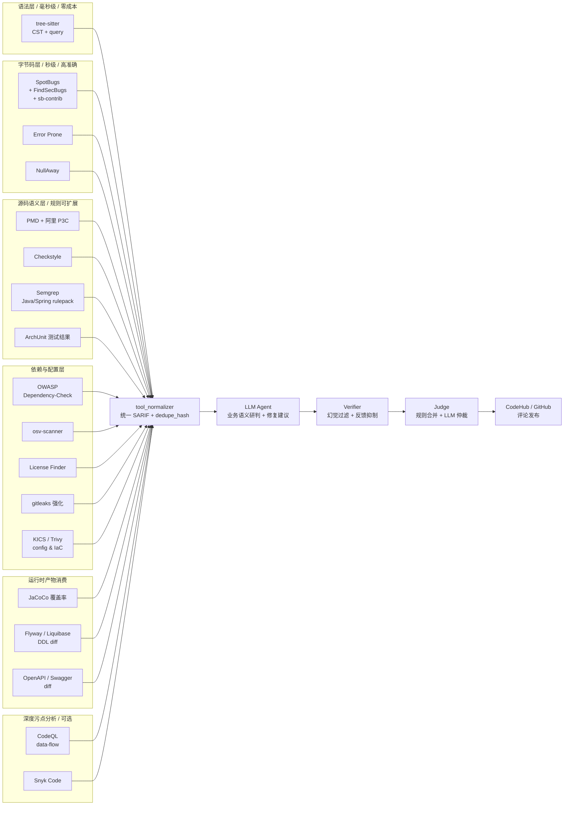

# Java Web 项目检视质量提升 — 静态工具体系改进方案

日期：2026-06-07
适用范围：jolt-codereview 平台，专注 Java / Spring Web 项目检视质量
目标读者：Codex / 团队评审 / 平台开发
关联文档：
- 原设计：`docs/plans/2026-06-06-ai-code-review-platform-design.md`
- 通用改进：`docs/plans/2026-06-06-design-improvements.md`（P0-P5 + P1-P10 + P2-P19）

---

## 0. 文档定位

本文档是上面两份文档的**专题补充**，**不重复**通用改进内容，只解答一个问题：

> **要让 jolt-codereview 在 Java Web 项目上达到工业级检视质量，应该接入哪些静态工具？它们各自负责什么？怎么与 LLM Agent 协作？**

核心设计思想：

> **确定性的事让确定性的工具做，LLM 只处理需要业务语义判断的少数问题。**

每个工具都必须满足三个集成原则：

1. 输出统一规整为 **SARIF 2.1.0** 或本平台 `finding_v1`；
2. 经 **Verifier** 校验存在性与去重；
3. 候选 finding 可作为上下文注入 LLM，由 Agent 二次研判（避免重复发表）。

### 0.1 2026-06-07 实施状态更新

本轮已把 Java Web 质量提升从"可接报告"推进到"自动运行 + 项目级策略 + 基线抑制"：

| 能力 | 当前状态 | 实现位置 |
| --- | --- | --- |
| Semgrep / gitleaks / ruff / bandit / eslint | 已自动运行，支持项目级禁用 | `worker/review_runtime.py` |
| PMD / Checkstyle / SpotBugs | 已自动运行；SpotBugs 在没有编译 class 时明确 skipped | `worker/review_runtime.py` |
| Dependency-Check / OSV / Trivy | 已自动运行；没有依赖清单时 skipped | `worker/review_runtime.py` |
| KICS / OpenAPI diff | 已自动运行；OpenAPI diff 需要项目配置基线 spec | `worker/review_runtime.py` |
| 工具报告统一解析 | 已覆盖 PMD、Checkstyle、SpotBugs、SARIF、Dependency-Check、OSV、Trivy、KICS、OpenAPI diff | `worker/tools/java_report_tool.py` |
| 项目级工具治理 | 支持 `tool_policy.enabled_tools`、`tool_policy.disabled_tools`、`tool_policy.static_runners`、`tool_policy.rule_overrides` | `worker/review_runtime.py` |
| 基线抑制 | 已新增 `review_baseline_suppressions` 表，并在工具结果进入 Agent 前过滤 | `src/backend/db/migrations.ts`、`worker/review_runtime.py` |
| 完整仓库输入 | 支持 `tool_policy.analysis_worktree_path` / `full_repo_worktree_path` / `workspace_path` 指向完整仓库工作区；未配置时回退到 diff 物化目录 | `worker/review_runtime.py` |
| 验证 | 已新增 runner inventory、missing/skipped、rule policy、baseline 验证 | `scripts/verify_java_tool_runners.py` |

生产落地建议：CI 镜像中应安装 `semgrep`、`gitleaks`、`pmd`、`checkstyle`、`spotbugs`、`dependency-check`、`osv-scanner`、`trivy`、`kics` 和 OpenAPI diff CLI；平台仍允许工具缺失时继续检视，但会在 trace 中记录 `missing`，便于运维补齐镜像。

---

## 1. 当前实现的不足（基线诊断）

调研 `worker/review_worker.py`（2234 行）后的事实：

| 现状 | 问题 |
| --- | --- |
| 仅集成 Semgrep / gitleaks / ruff / eslint | 没有任何 Java 字节码分析；Spring 框架陷阱完全靠 LLM 推断 |
| `static_findings()` 自带启发式规则 | 覆盖面窄、误报多，无法替代真正的 SAST |
| `diff_symbol_summary` 是正则启发式 | Java 解析准确率约 70%，遗漏注解、泛型、Lambda |
| `code_index_snapshots` 表空跑 | 没有符号索引，调用关系/Bean 拓扑/路由表全靠 LLM 推断 |
| 没有 CVE / 依赖审查 | Log4Shell、Spring4Shell、Fastjson 类问题完全漏检 |
| 没有覆盖率消费 | Test Agent 凭感觉说"覆盖不足"，用户无法信服 |
| 没有 DDL / API 兼容性检测 | 数据库迁移与接口破坏性变更全凭运气 |

**结论**：当前实现是一个"语言无关的通用 AI Code Review MVP"，对 Java Web 这种**工具链高度成熟**的生态来说，**不接入业界成熟工具就等于让 LLM 重新造轮子**——既慢又贵又不准。

---

## 2. 工具协作总览

### 2.1 架构图



### 2.2 工具速览

| 层级 | 工具 | 覆盖问题 | 单 PR 耗时 | ROI |
| --- | --- | --- | --- | --- |
| 语法层 | tree-sitter | 注解缺失、路由表、命名、危险 API、catch 吞异常 | < 1s | ★★★★★ |
| 字节码层 | SpotBugs + FindSecBugs + sb-contrib | NPE / 资源泄漏 / 线程 / 反序列化 / SSRF / SQL 注入 | 10-30s | ★★★★★ |
| 字节码层 | Error Prone + NullAway | 编译期类型 / API 误用 / Null 安全 | 与 build 同步 | ★★★★☆ |
| 源码层 | PMD + 阿里 P3C | 规范、复杂度、Spring 专项规则 | 5-15s | ★★★★☆ |
| 源码层 | Checkstyle | 基础规范基线（命名 / 格式 / import） | 3-10s | ★★★☆☆ |
| 源码层 | Semgrep + Java/Spring rulepack | 语义级规则、跨多语言、规则易写 | 5-15s | ★★★★★ |
| 源码层 | ArchUnit 测试结果消费 | 架构约束（层依赖 / 包命名 / 注解约束） | 复用 CI 产物 | ★★★★☆ |
| 依赖层 | OWASP Dependency-Check | CVE 漏洞（Log4Shell / Spring4Shell / Fastjson） | 10-60s | ★★★★★ |
| 依赖层 | osv-scanner | 多生态漏洞库，速度快 | < 10s | ★★★★☆ |
| 依赖层 | License Finder / ScanCode | 开源协议合规 | < 10s | ★★★☆☆ |
| 依赖层 | gitleaks / TruffleHog 强化 | 仓库 / diff 中的密钥泄露（含中文场景） | < 5s | ★★★★★ |
| 配置层 | KICS / Trivy config | application.yml / Dockerfile / k8s / IaC 配置风险 | < 10s | ★★★★☆ |
| 运行时 | JaCoCo 覆盖率消费 | 测试覆盖、新增代码未覆盖 | 复用 CI 产物 | ★★★★☆ |
| 运行时 | Flyway / Liquibase DDL diff | schema 变更风险（加列 / 删列 / 类型变更） | < 5s | ★★★★★ |
| 运行时 | OpenAPI / Swagger diff | 接口签名 / 字段 / 兼容性 | < 5s | ★★★★☆ |
| 深度 | CodeQL（可选） | 跨过程污点分析、复杂安全规则 | 1-5 min | ★★★★☆ |
| 深度 | Snyk Code（可选 / 商业） | AI 增强语义安全规则 | 10-60s | ★★★☆☆ |

---

## 3. 工具详细方案

### J0 tree-sitter（语法层基础设施）

#### 现状问题
worker 用启发式正则提取符号；Java 准确率约 70%，遗漏注解、嵌套类、泛型、Lambda；`code_index_snapshots` 表空跑。

#### 业界对标
- **Sourcegraph、Cursor、Continue、Zed、GitHub Semantic** 全部以 tree-sitter 作为语法解析基础设施。
- **tree-sitter-java** 是 GitHub 官方维护的语法库，成熟稳定。

#### 改进目标
1. 替代当前 `diff_symbol_summary` 启发式实现，符号解析准确率 99%+；
2. 提供按 commit SHA 缓存的增量索引（替代空跑的 `code_index_snapshots`）；
3. 写 50 条核心 query，承担"注解存在性 / 路由表 / 命名 / 危险 API / catch 吞异常 / import 跨层"等纯语法层确定性检查。

#### 具体内容

**a) 替代 diff 符号摘要**

```scheme
(method_declaration
  name: (identifier) @method.name
  parameters: (formal_parameters) @method.params)

(class_declaration name: (identifier) @class.name)
(annotation name: (_) @anno.name arguments: (annotation_argument_list)? @anno.args)
```

**b) HTTP 路由表**（Java Web 检视的关键上下文）

```scheme
(method_declaration
  (modifiers
    (annotation
      name: (identifier) @anno (#match? @anno "^(Get|Post|Put|Delete|Patch|Request)Mapping$")
      arguments: (annotation_argument_list) @route_args))
  name: (identifier) @handler)
```

**c) 注解存在性检查（Java Web 最高频）**

| 规则 | tree-sitter query 思路 |
| --- | --- |
| Controller 方法缺 `@Valid` | 找 `@RequestMapping` 方法，参数中没有 `@Valid` 注解 |
| Service 方法缺 `@Transactional` | 找含 `save/update/delete/insert` 关键词的方法，类未注解、方法未注解 |
| 字段注入 `@Autowired` | 找类字段的 `@Autowired`，提示改构造器注入 |
| 测试缺 `@Test` 或断言 | 找 `*Test.java` 方法，body 内无 `assert*` / `verify` 调用 |

**d) 危险 API 黑名单**

```scheme
;; Runtime.exec / ProcessBuilder
(method_invocation
  object: (identifier) @obj (#match? @obj "^(Runtime|ProcessBuilder)$")
  name: (identifier) @m (#match? @m "^(exec|start)$"))

;; ObjectInputStream.readObject
(method_invocation
  name: (identifier) @m (#eq? @m "readObject"))

;; Fastjson autoType
(method_invocation
  object: (identifier) @obj (#eq? @obj "JSON")
  name: (identifier) @m (#match? @m "^(parseObject|parse)$"))
```

**e) catch 块吞异常**

```scheme
(catch_clause body: (block . "}" .))   ;; 空块
(catch_clause body: (block
  (expression_statement
    (method_invocation
      name: (identifier) @m (#eq? @m "printStackTrace")))))
```

**f) MyBatis Mapper.java ↔ Mapper.xml 关联**

tree-sitter-java 解析 `*Mapper.java` 方法签名，tree-sitter-xml 解析 `<select id="xxx">`，按 `namespace + id` 文本匹配；diff 一边变另一边自动拉入上下文。

**g) Spring Bean 拓扑候选图**

扫描 `@Component / @Service / @Repository / @Controller / @Bean / @Configuration`，按字段类型名做"候选边"匹配。90% 项目同名类只有一个，候选边即真实边；剩余歧义打 `unresolved` 交 Agent 判断。**性价比远高于 JDT**。

#### Agent 协作
- 高确定性 finding（catch 吞异常、危险 API 黑名单、SQL `${}`）**不走 LLM**，由 Worker 直接产 finding；
- Bean 候选图 / 路由表 / Mapper 配对作为**上下文注入** Agent prompt。

---

### J1 SpotBugs + FindSecBugs + sb-contrib（字节码层基础设施）

#### 现状问题
没有任何 Java 字节码分析。SQL 注入、SSRF、反序列化、资源泄漏、线程安全等问题在源码层难以稳定识别，必须靠字节码层数据流分析。

#### 业界对标
- **Meta Infer / SapFix** 体系长期依赖字节码层分析做污点跟踪。
- **Google ErrorProne + 内部 Bugswarm** 在 Java 上以字节码 + AST 双路检测见长。
- **Sonatype / JFrog Xray** 商业方案的核心检测器同样基于字节码层。
- **FindSecBugs** 是 OWASP 推荐的 Java 安全扫描事实标准，包含 130+ 安全规则，覆盖 OWASP Top 10。

#### 改进目标
1. 把 SpotBugs（基础 bug）+ FindSecBugs（安全）+ sb-contrib（额外坏味道）作为 Java Web 项目的**默认开启**工具链。
2. 输出 SARIF，由 Worker 统一规整为 finding_v1，经 Verifier 校验后注入 Agent 上下文（不直接发布）。

#### 具体内容

```yaml
# worker/tools/spotbugs_runner.py 行为契约
input:
  repo_path: /workspace/{review_run_id}
  classes_path: target/classes        # 或 gradle build/classes/java/main
  include_filters:
    - {category: SECURITY}
    - {category: CORRECTNESS}
    - {category: MULTITHREADED_CORRECTNESS}
    - {category: BAD_PRACTICE}
  effort: max
  threshold: low
output:
  sarif_path: artifacts/spotbugs.sarif
  finding_summary:
    - rule_id: SQL_INJECTION_JDBC
      severity: critical
      file: src/main/java/.../OrderDao.java
      line: 88
      message: ...
      evidence_snippet: ...
```

**集成要点**：
- 必须能在不完整构建时 fallback：若没有 `target/classes`，则用 `spotbugs --source-only` 模式（功能受限但仍可用）。
- 规则集与项目级 `spotbugs-exclude.xml` 联动，避免与 SonarQube 重复报告。
- FindSecBugs 的 `MASKED_FIELD` / `PREDICTABLE_RANDOM` 等规则误报较多，默认仅作为 LLM 上下文输入。

#### Agent 协作
- candidate finding 注入对应 owner Agent prompt：`<spotbugs_candidates>...</spotbugs_candidates>`
- Agent 任务：判断是否真实业务问题、是否已有运行时防护、合并相似 finding；可对单条 candidate 投 `confirm/dismiss/refine`。

---

### J2 Error Prone + NullAway（编译期 + Null 安全）

#### 现状问题
LLM 对"是否会 NPE"判断不稳定；很多 Java Web 项目仍是 JDK 8/11，未启用 Optional / JSR-305，NPE 是头号生产事故。

#### 业界对标
- **Google 内部** 所有 Java 代码必跑 Error Prone（CACM 2018 公开描述）。
- **Uber NullAway** 公开论文报告：把 NullAway 引入大型 Android / Java 项目后，NPE 类生产事故下降 80%+。
- **Meta** 在 Java / Kotlin 代码上使用 Infer 的 Null 检查器作为 CI 必过。

#### 改进目标
1. 在 CI 阶段为项目集成 Error Prone（Maven / Gradle 插件），并把 Error Prone 报告作为本平台的 candidate finding 来源。
2. 鼓励项目逐步引入 NullAway，把 `@Nullable` / `@NonNull` 注解和包级 `@NullMarked` 作为约束。

#### 具体内容
- Worker 不直接跑 Error Prone（需要项目 build），而是消费 CI 输出（Maven Surefire / Gradle Test 报告中的 ErrorProne 部分），通过 `external-reports` API 注入。
- 对未启用 Error Prone 的项目，Worker 提供启用建议（一次性 PR 模板，含 Maven / Gradle 配置片段）。
- NullAway 集成后，对每个 @Nullable 返回值的未保护使用直接产生 critical finding。

#### Agent 协作
- 接收 Error Prone 的 `BUG` 级别报告时不再用 LLM 复述，仅由 LLM 判断是否需要给出修复建议（Quick Fix）。

---

### J3 PMD + 阿里 P3C 规则集

#### 现状问题
当前没有源码层规则引擎，LLM 在"代码规范、复杂度、命名"等确定性问题上浪费 token。

#### 业界对标
- **PMD** 是 Java 生态最成熟的源码规则引擎，支持自定义 XPath 规则。
- **阿里 P3C**（GitHub: alibaba/p3c）是公开的中文 Java 规约规则集，覆盖《阿里巴巴 Java 开发手册》。
- **Spring 官方文档** 与 **Pivotal Tools** 提供了一份 "Spring Best Practices" PMD ruleset 参考。

#### 改进目标
1. 默认开启 PMD + 阿里 P3C 规则集（适合中文团队）。
2. 平台提供 Spring 专属规则模板（@Transactional self-invocation、@RequestMapping 默认方法、@Autowired 字段注入提示、Mapper XML `${}` 等）。

#### 具体内容
- `worker/tools/pmd_runner.py` 输出 SARIF，规则文件路径：
  - `rules/pmd/spring-best-practices.xml`
  - `rules/pmd/alibaba-p3c.xml`（外部 mirror）
  - `rules/pmd/{project}-custom.xml`（项目级覆写）
- 默认 minimumPriority=3（避免 noise）；priority 1-2 直接 finding，3-5 仅作上下文。

#### Agent 协作
- PMD 命中的"命名/格式/复杂度"类规则**不进入 LLM**，由 Worker 直接产 finding（低噪声模式 + 用户可关闭某规则）。

---

### J4 Checkstyle（基线规范，仅作健康度信号）

#### 现状问题
团队规范基线不统一时，LLM 会就空格、import、行长等鸡毛蒜皮的事浪费输出。

#### 业界对标
- **Google Java Style / Sun Code Convention / Spring Java Format** 等公开 ruleset 都基于 Checkstyle。
- 工业界共识：基线规范不应进入 PR review，应在本地 IDE 与 CI pre-commit 解决。

#### 改进目标
- Worker 集成 Checkstyle，但**默认不产 finding**，只把"是否符合基线"作为 PR 健康度信号写入 trace（Coverage Card 展示）。
- 若团队希望强制，可在项目策略中改为 `report_as_finding=true`。

---

### J5 Semgrep Java / Spring rulepack（语义级规则）

#### 现状问题
当前 Semgrep 已集成，但未启用任何 Java / Spring 专项规则包。

#### 业界对标
- **Semgrep Registry** 提供官方维护的 `java`、`java.spring`、`java.lang.security`、`java.jwt` 规则包，覆盖 200+ Java 专项规则。
- **r2c / GitHub Security Lab** 公开案例展示 Semgrep 在 Java Web 项目上的检出对比 SpotBugs 有互补性。

#### 改进目标
为 Java Web 项目自动启用如下规则包：
- `p/java` （通用）
- `p/spring` （Spring 框架）
- `p/owasp-top-ten` （OWASP）
- `p/jwt`（如检测到 JJWT / Auth0 jwt 依赖）
- `p/xxe`、`p/sqli`、`p/ssrf`、`p/secrets`
- 项目自定义规则：`rules/semgrep/{project}/*.yml`

#### 具体内容
- `semgrep --config p/java --config p/spring --config p/owasp-top-ten --sarif`
- 规则版本通过通用改进文档 P2-12 工具链快照固定，避免规则更新导致历史 finding 漂移。
- 与 SpotBugs / PMD 结果做 dedupe_hash 去重（见 J11）。

---

### J6 ArchUnit 测试结果消费（架构约束）

#### 现状问题
团队规范"infrastructure 不依赖 interfaces"、"Controller 必须返回 ResponseEntity"等架构约束，LLM 无法稳定保证。

#### 业界对标
- **ArchUnit** 是 Java 架构测试事实标准，被 Spring、Atlassian、ThoughtWorks 广泛使用。
- 业界经验：架构约束应作为团队"长存测试"，而非靠 PR 评审一次次提醒。

#### 改进目标
- 不自己实现架构约束引擎，而是**消费 ArchUnit 测试报告**。
- 若 ArchUnit 测试失败，强制阻断该 PR 的"自动发布"步骤，并把违规位置作为 critical finding 注入。

#### 具体内容
- 新增 API：`POST /api/mr-review/merge-requests/:mrId/external-reports`
  - body: `{ type: "archunit", report_url: "...", commit_sha: "..." }`
  - 由 CI 系统在 ArchUnit 测试结束后回调上传。
- Worker 解析 ArchUnit XML（JUnit 5 标准格式），失败的 rule 转 finding。

---

### J7 OWASP Dependency-Check + osv-scanner + License Finder

#### 现状问题
依赖漏洞（Log4Shell、Spring4Shell、Fastjson、Snakeyaml）是 Java Web 历史上最大类生产事故来源，当前实现完全缺位。

#### 业界对标
- **OWASP Dependency-Check** 是 Apache 等开源项目和 OWASP 推荐的免费工具，NVD 数据完整。
- **osv-scanner**（Google 开源）速度快，多生态（Maven / Gradle / npm / PyPI），与 OSV.dev 数据库同步。
- **GitHub Dependabot** 与 **Snyk** 是商业事实标准；本平台可作为补充而非替代。
- **License Finder / ScanCode** 是开源协议合规事实标准。

#### 改进目标
1. 任何 pom.xml / build.gradle / build.gradle.kts 变更都强制走依赖审查 Agent。
2. critical / high CVE 直接产 finding，medium 仅上下文。
3. 引入新 license（特别是 GPL / AGPL / LGPL）必须标红，需项目管理员显式批准。

#### 具体内容

```yaml
# agent-skills/dependency-review/SKILL.md 核心检查项
- CVE 严重等级 ≥ HIGH
- 升级跨大版本（major bump）需评估 breaking change
- 引入 GPL / AGPL / LGPL / SSPL 等强传染性 license
- 移除依赖但代码仍 import
- 多版本冲突（同 artifactId 多 version）
- 依赖收敛策略（dependencyManagement）变化
```

#### Agent 协作
- Dependency-Check 输出 SARIF；Worker 解析 + Agent 二次过滤"已知例外"（如内部 fork、已打补丁）。
- 与 GitHub Dependabot 报告做去重（已有 Dependabot Alert 的 CVE 不重复发评论）。

---

### J8 gitleaks / TruffleHog 强化（密钥扫描 → 中文场景）

#### 现状问题
当前 gitleaks 已集成，但仅扫描全仓；对 Java Web 项目 application.yml / properties / .env / Docker secrets / k8s configmap 缺少专门规则；中文云厂商场景未覆盖。

#### 改进目标
- 扩展规则集：覆盖 `JDBC URL with password`、`spring.datasource.password=...`、`Druid 监控密码`、`Nacos 鉴权`、`Apollo Config secret`、`阿里云 / 腾讯云 / 华为云 AK SK`、`钉钉 / 飞书 / 企微 webhook token` 等中文场景。
- 对 git history 做"新引入"判定（baseline diff），避免老仓库历史泄密反复报。

#### 具体内容
扩展通用改进文档 §6.9.3 redactor 管线规则表，增加：

| 类别 | 检测模式 | 替换 |
| --- | --- | --- |
| JDBC URL with password | `jdbc:\w+://[^?\s]+\?.*password=[^&\s]+` | `<REDACTED:jdbc_pwd>` |
| Spring 数据源密码 | `spring\.datasource\.password\s*[:=]\s*[^\s]+` | `<REDACTED:spring_pwd>` |
| 阿里云 AK | `LTAI[A-Za-z0-9]{12,30}` | `<REDACTED:ali_ak>` |
| 腾讯云 SK | `AKID[A-Za-z0-9]{13,40}` | `<REDACTED:tencent_sk>` |
| Nacos 鉴权 token | `nacos\.core\.auth\.\w+\.secret\.key\s*=\s*[^\s]+` | `<REDACTED:nacos_secret>` |
| 钉钉 webhook | `https://oapi\.dingtalk\.com/robot/send\?access_token=[A-Za-z0-9]+` | `<REDACTED:dingtalk>` |

---

### J9 KICS / Trivy config（配置 & IaC 风险）

#### 现状问题
Java Web 项目除了代码，还有 Dockerfile、k8s manifest、application.yml、Helm chart 等"非代码"配置；这些位置的安全 / 规范问题当前完全无人扫描。

#### 业界对标
- **Checkmarx KICS** 与 **Aqua Trivy config** 是 IaC 配置扫描事实标准；覆盖 Dockerfile、Kubernetes、Helm、Terraform、CloudFormation、Ansible。
- Java Spring 项目最常见的 actuator 全部暴露、`management.endpoints.web.exposure.include=*` 等问题，可由这些工具规则覆盖。

#### 改进目标
- 对项目内的 `Dockerfile`、`docker-compose.yml`、`k8s/*.yaml`、`helm/**`、`application*.yml/properties` 默认开启 KICS 或 Trivy config 扫描。
- 重点规则：actuator 暴露、JVM 参数（`-Xrunjdwp` 等远程调试端口）、容器以 root 运行、镜像未指定 tag、Service 暴露 NodePort / LoadBalancer 无白名单。

---

### J10 运行时产物消费：JaCoCo + Flyway / Liquibase + OpenAPI diff

#### 现状问题
LLM 无法可靠判断"是否真的没覆盖"、"DDL 是否兼容"、"API 是否破坏向后兼容"。这些都有现成工具产出权威结论。

#### 业界对标
- **JaCoCo** 是 Java 生态事实标准的覆盖率工具，CI 集成成熟。
- **Flyway / Liquibase** 提供 dry-run + 变更对比能力。
- **openapi-diff（OpenAPI Tools）** 与 **Tufin oasdiff** 提供合约级 breaking change 检测。

#### 改进目标
1. **JaCoCo 覆盖率消费**：通过外部报告 API 上传 jacoco.xml；Worker 计算"新增 / 修改行的覆盖率"，未覆盖行 → Test Agent 强信号 finding。
2. **DDL 变更检测**：扫描 `src/main/resources/db/migration/**`（Flyway）或 `src/main/resources/changelog/**`（Liquibase）的 diff；命中 `DROP COLUMN / ALTER TYPE / 非空列无默认值` 等强制 deep 等级 + critical finding。
3. **API 兼容性**：若项目有 `openapi.yml` / `swagger.json` 或集成了 springdoc-openapi，CI 阶段产出新旧版本对比报告，breaking change 强制 finding。

#### 具体内容

```http
POST /api/mr-review/merge-requests/:mrId/external-reports
Content-Type: application/json

{
  "type": "jacoco" | "archunit" | "openapi-diff" | "flyway-diff" | "errorprone" | "spotbugs",
  "commit_sha": "abc1234",
  "report_format": "sarif" | "junit-xml" | "jacoco-xml" | "openapi-diff-json",
  "report_url": "s3://ci-reports/...",   // 或 inline payload
  "metadata": {...}
}
```

#### Agent 协作
- Test Agent 看到 JaCoCo 覆盖率报告后，**不再凭感觉**说"建议增加测试"，而是直接定位到 `OrderService.cancel()` 第 88-94 行未覆盖。
- DB Agent 看到 Flyway DDL diff 后能够具体定位破坏性变更（如 `ALTER TABLE order DROP COLUMN remark`），并提示数据回滚方案。

---

### J11 多工具结果统一与去重

#### 现状问题
SpotBugs、PMD、Semgrep、Error Prone、tree-sitter 自定义规则**会发现同一问题**（如 SQL 注入），如果不去重会出现 5 条评论刷屏。

#### 业界对标
- **GitHub Code Scanning** 用 SARIF 统一格式 + `partialFingerprints` 字段做跨工具去重。
- **SonarQube** 用 issue_key + content_hash 做跨规则归一化。

#### 改进目标
1. 所有工具输出**强制规整为 SARIF 2.1.0**；Worker 维护统一适配层 `tool_normalizer.py`。
2. dedupe_hash 计算扩展，跨工具同位置同语义 finding 归并到一条；保留"由哪些工具命中"作为 confidence 加权依据。

#### 具体内容

```python
# 跨工具 dedupe_hash 计算扩展（覆盖通用改进 P0-4 的实现）
dedupe_hash = sha1(
  normalized_rule_category || "|" ||      # SQL_INJECTION（无论来自哪个工具）
  file_path || "|" ||
  line_bucket(line, bucket_size=5) || "|" ||
  normalize(evidence_snippet)
)

# rule_category 归一化映射表（部分示例）
RULE_CATEGORY_MAP = {
  "SQL_INJECTION_JDBC": "SQL_INJECTION",                # SpotBugs
  "java.lang.security.audit.sqli.jdbc-sqli": "SQL_INJECTION",  # Semgrep
  "SpringInjection": "SQL_INJECTION",                   # PMD
  ...
}

# Confidence 加权：被 N 个工具命中则 +0.1 * (N-1)，上限 0.99
if hit_count >= 2:
    confidence = min(0.99, base_confidence + 0.1 * (hit_count - 1))
```

跨工具 finding 在 trace 中保留每个工具的原始引用，便于排障。

---

### J12 CodeQL / Snyk Code（深度污点分析，可选）

#### 现状问题
即便有 SpotBugs，跨过程跨文件的污点分析仍然薄弱（例如：HTTP 入参 → 多层 Service → 最终拼接 SQL）。

#### 业界对标
- **GitHub CodeQL** 是数据流分析事实标准，规则可扩展，对 Java Web 框架支持完善（Spring、Struts、JAX-RS）。
- **Snyk Code** 是商业 AI 增强语义分析，集成简单但需付费。
- **Checkmarx / Fortify** 商业 SAST 在大型企业广泛使用。

#### 改进目标
- 作为 **deep 等级 + 安全敏感路径** 才触发的可选工具（性能 / 成本考虑）。
- 优先支持 CodeQL（开源 + 规则可写）；接入 Snyk Code 作为商业版补充。

#### 具体内容
- Worker 不本地跑 CodeQL（耗时太长），而是通过 GitHub Actions / CodeQL CLI 异步分析；分析完成后回调 `external-reports` API。
- 仅在以下条件之一时触发：
  - effort = deep
  - 命中 security-sensitive-paths
  - 项目管理员显式开启 "deep-security-scan"

---

## 4. 工具能力矩阵（验收用）

| 能力维度 | tree-sitter | SpotBugs+FSB | Error Prone+NullAway | PMD | Checkstyle | Semgrep | ArchUnit | Dep-Check/osv | KICS/Trivy | JaCoCo | Flyway diff | OpenAPI diff | CodeQL |
| --- | --- | --- | --- | --- | --- | --- | --- | --- | --- | --- | --- | --- | --- |
| Java 注解扫描 | ★★★★★ | ★★ | ★★★ | ★★★ | ★★ | ★★★ |  |  |  |  |  |  | ★★★ |
| Null 安全 |  | ★★★ | ★★★★★ |  |  | ★ |  |  |  |  |  |  | ★★★★ |
| SQL 注入 | ★★ | ★★★★ |  | ★★★ |  | ★★★★ |  |  |  |  |  |  | ★★★★★ |
| SSRF / 反序列化 |  | ★★★★ |  | ★★ |  | ★★★★ |  |  |  |  |  |  | ★★★★★ |
| 资源泄漏（IO/JDBC） |  | ★★★★★ | ★★ | ★★★ |  | ★★ |  |  |  |  |  |  | ★★★★ |
| 并发安全 |  | ★★★★ | ★★★ | ★★ |  | ★★ |  |  |  |  |  |  | ★★★ |
| Spring 框架陷阱 | ★★★ | ★★ | ★★ | ★★★★ |  | ★★★★★ | ★★★★★ |  |  |  |  |  | ★★★ |
| 架构约束 | ★★ |  |  |  |  |  | ★★★★★ |  |  |  |  |  |  |
| 规范基线 | ★★★ |  |  | ★★★★ | ★★★★★ |  |  |  |  |  |  |  |  |
| CVE 漏洞 |  |  |  |  |  |  |  | ★★★★★ |  |  |  |  |  |
| 协议合规 |  |  |  |  |  |  |  | ★★★★ |  |  |  |  |  |
| 密钥泄露 | ★★ |  |  |  |  | ★★★ |  |  |  |  |  |  |  |
| 配置 / IaC 风险 |  |  |  |  |  | ★★ |  |  | ★★★★★ |  |  |  |  |
| 测试覆盖判定 |  |  |  |  |  |  |  |  |  | ★★★★★ |  |  |  |
| Schema 变更 |  |  |  |  |  |  |  |  |  |  | ★★★★★ |  |  |
| API 兼容性 |  |  |  |  |  | ★★ |  |  |  |  |  | ★★★★★ |  |
| 跨过程数据流 |  | ★★★ |  |  |  | ★★ |  |  |  |  |  |  | ★★★★★ |

---

## 5. 与 LLM Agent 的分工边界

| 工作类型 | 由谁做 |
| --- | --- |
| 注解存在性、命名规范、危险 API 黑名单 | tree-sitter |
| 字节码层 bug（NPE、资源泄漏、线程） | SpotBugs / Error Prone |
| 规范与基线 | PMD / Checkstyle |
| CVE / License | Dependency-Check / osv-scanner / License Finder |
| 密钥扫描 | gitleaks（强化） |
| 配置 / IaC 风险 | KICS / Trivy |
| 测试覆盖 | JaCoCo 报告 + Test Agent 解读 |
| DDL / API 兼容性 | Flyway / Liquibase diff + OpenAPI diff |
| 跨过程污点 | CodeQL（可选） |
| **业务语义判断**（"该接口是否应该鉴权"、"该事务边界是否合理"、"该缓存策略是否符合业务"） | **LLM Agent**，结合上下文图谱与候选 finding |
| **跨候选 finding 的语义合并与降噪** | LLM Judge |
| **修复建议（Quick Fix patch）** | LLM Agent，简单场景由规则模板直接生成 |

**核心原则**：工具能稳定给出的事，绝不让 LLM 做；LLM 只对"需要业务语义、需要跨候选研判、需要自然语言解释和修复建议"的部分发力。

**预期收益**：
- LLM 成本降 **60-70%**（确定性问题不进 LLM）
- 准确率提升 **20%+**（工具命中比 LLM 推断稳）
- 检视质量上限被工具体系拉高，不再受限于 LLM 当下的能力波动

---

## 6. 落地优先级与里程碑

### 6.0 当前实施状态

> 状态更新时间：2026-06-07。本表用于执行跟踪，每完成一项必须更新为“已完成”并保留验证证据。

| 编号 | 能力项 | 当前状态 | 验证证据 |
| --- | --- | --- | --- |
| J0-A | Java Web 结构化规则预扫描：Controller 入参、字段注入、异常、弱类型领域对象、Redis、依赖、DDL、配置 | 已完成 | `worker/tools/java_web_static_tool.py`；本地扫描 Java fixture 命中 16 条、15 个 rule_id |
| J0-B | 专家 Agent 自动加载绑定 Markdown 规范文档 | 已完成 | 10 个专家均绑定 `JAVA_WEB_STANDARD.md`；`rule_documents` 种子数据读取真实 Markdown；`markdown_rule_parser.py` 支持“规范说明/检查点/如何检查/正反例”章节解析；`npm run verify:agents` 通过 |
| J1-A | SpotBugs / FindSecBugs 报告解析入口 | 已完成 | `worker/tools/java_report_tool.py` 支持 SpotBugs/FindSecBugs XML 与 SARIF 转 finding；`python3 scripts/verify_java_report_tool.py` 通过 |
| J2-A | Error Prone / NullAway 外部报告接入 | 已完成 | external reports API + Worker `external_report_findings()` 消费；Checkstyle XML 兼容 Error Prone/NullAway；`python3 scripts/verify_java_report_tool.py` 通过 |
| J3-A | PMD / 阿里 P3C 报告解析入口 | 已完成 | PMD/P3C XML violation 转统一 finding；`python3 scripts/verify_java_report_tool.py` 通过 |
| J4-A | Checkstyle 报告解析入口 | 已完成 | Checkstyle XML error 转统一 finding；`python3 scripts/verify_java_report_tool.py` 通过 |
| J5-A | Semgrep Java/Spring 规则包 | 已完成 | `semgrep_rules_path()` 生成 8 条本地规则，覆盖 Java/Spring `@Valid`、JDBC SQL 拼接、Redis KEYS/TTL、异常回显、Actuator 暴露；本地 rulepack 生成校验通过 |
| J6-A | ArchUnit 外部报告 API | 已完成 | `external_review_reports` 表和 external reports API 已实现 |
| J7-A | Dependency Agent 和依赖规则 | 已完成 | `dependency_agent`、`agent-skills/dependency-review/JAVA_WEB_STANDARD.md`、本地依赖规则扫描 |
| J8-A | gitleaks 中文场景强化 | 已完成 | `gitleaks_config_path()` 生成 3 条中文/云厂商/Spring 配置密钥规则；TOML 解析校验通过；gitleaks prescan 使用 `--config` 加载本地规则 |
| J9-A | Spring 配置风险扫描 | 已完成 | 本地规则检测 actuator `include=*` 和明文密码 |
| J10-A | JaCoCo / Flyway / OpenAPI 外部报告 API | 已完成 | external reports API 支持任意 `type/report_format` 入库；Worker 消费 JaCoCo XML、SARIF/JSON/text 外部报告；`python3 scripts/verify_java_report_tool.py` 通过 |
| J10-B | Flyway / Liquibase DDL diff 本地规则 | 已完成 | 本地规则检测 `DROP COLUMN/TABLE` 和 `ADD COLUMN NOT NULL` 无默认值 |
| J11-A | 跨工具 normalized category 和 dedupe_hash | 已完成 | `worker/tools/tool_normalizer.py` |
| J12-A | CodeQL / Snyk deep 外部报告入口 | 已完成 | external reports API + Worker SARIF/JSON 消费；CodeQL SARIF 与 Snyk/Dependency JSON 可转换为工具 finding；`python3 scripts/verify_java_report_tool.py` 通过 |

| 阶段 | 工具 | 周期 | 关键交付 |
| --- | --- | --- | --- |
| 第 1 周 | tree-sitter + Semgrep Java/Spring rulepack | 1 周 | 注解、危险 API、SQL 模式、基础 Spring 规则上线；替换启发式 `diff_symbol_summary` |
| 第 2-3 周 | SpotBugs + FindSecBugs + gitleaks 强化 | 2 周 | 字节码层安全 / 正确性问题覆盖；密钥扫描中文规则补全 |
| 第 4-5 周 | PMD + 阿里 P3C 规则 + Checkstyle 基线 | 2 周 | 规范与基线分离；LLM 不再做规范类检视 |
| 第 6 周 | OWASP Dependency-Check + osv-scanner + License Finder | 1 周 | pom.xml / build.gradle 变更必走 CVE + License 审查 |
| 第 7 周 | external-reports API + JaCoCo / ArchUnit / Flyway / OpenAPI 消费 | 1 周 | 运行时产物接入；Test Agent 与 DB Agent 强化 |
| 第 8 周 | KICS / Trivy config | 1 周 | application.yml / Dockerfile / k8s 配置安全 |
| 第 9-10 周 | Error Prone + NullAway 启用建议 + 项目接入指南 | 2 周 | Null 安全治理 |
| 第 11-12 周 | 工具结果统一去重（J11）+ Confidence 加权 | 2 周 | 多工具刷屏问题彻底解决 |
| 第 13 周+ | CodeQL（可选 deep 路径） | 按需 | 安全敏感项目深度污点分析 |

---

## 7. 需要修改原设计 / 通用改进文档的位置

本文档的实施会触及以下章节，建议 Codex 在合并时联动调整：

| 原文档 / 章节 | 联动改动 |
| --- | --- |
| 设计文档 §7「静态分析与结构化上下文」 | 新增 §7.4「Java Web 静态工具栈」并嵌入本文档的 J0-J12 |
| 设计文档 §7.2 推荐工具表 | 增加 SpotBugs / FindSecBugs / PMD / Error Prone / NullAway / Dependency-Check / osv-scanner / KICS / JaCoCo / Flyway / OpenAPI diff / CodeQL 等行 |
| 设计文档 §6.3 专家 Agent 列表 | 新增 `dependency-review` Agent；MR triage 命中 pom.xml 时强制路由 |
| 设计文档 §6.4 分级路由 | 命中 schema 变更 / security-sensitive-paths / pom.xml 大版本变更 时强制 deep |
| 设计文档 §10.5 Coverage Card | 增加"工具检查项"清单（哪些 J 工具跑了、产出多少候选 finding） |
| 通用改进 P0-4 dedupe_hash | 扩展为"跨工具 normalized_rule_category"算法（见 J11） |
| 通用改进 §6.9.3 redactor 管线 | 增加中文场景密钥规则（见 J8） |
| TS Backend `src/backend/server.ts` | 新增 `POST /api/mr-review/merge-requests/:mrId/external-reports` 路由（见 J6 / J10） |
| Worker `worker/review_worker.py` | 新增 `tool_normalizer.py`、`spotbugs_runner.py`、`pmd_runner.py`、`dependency_check_runner.py`、`treesitter_index.py` 等模块 |
| `agent-skills/` | 新增 `dependency-review/` 目录及 SKILL.md |

---

## 8. 验收标准

工具体系完整接入后，应满足以下验收指标：

| 指标 | 目标 |
| --- | --- |
| 工具产出覆盖率 | 90% 的 finding 携带至少一个工具 candidate 引用 |
| 跨工具去重率 | 同一问题被多工具命中时合并为 ≤ 1 条最终 finding |
| LLM 单 PR 平均 token 消耗 | 较接入前下降 ≥ 60% |
| 单 PR 平均检视时长 | standard 等级 ≤ 90s（接入工具不应大幅拖慢） |
| Java 注解相关 finding 准确率 | ≥ 99%（tree-sitter 承担） |
| CVE 漏报率 | ≤ 5%（以 Dependabot 全集为对照） |
| DDL 破坏性变更检出率 | 100%（Flyway / Liquibase diff 必检出） |
| 测试覆盖率 finding 误报率 | ≤ 10%（JaCoCo 实测为准） |

---

## 9. 参考资料

### 工具官方
- SpotBugs：https://spotbugs.github.io/
- FindSecBugs：https://find-sec-bugs.github.io/
- sb-contrib：https://github.com/mebigfatguy/fb-contrib
- Google Error Prone：https://errorprone.info/
- Uber NullAway：https://github.com/uber/NullAway
- PMD：https://pmd.github.io/
- 阿里 P3C：https://github.com/alibaba/p3c
- Checkstyle：https://checkstyle.org/
- Semgrep Registry：https://semgrep.dev/r
- ArchUnit：https://www.archunit.org/
- OWASP Dependency-Check：https://owasp.org/www-project-dependency-check/
- osv-scanner：https://github.com/google/osv-scanner
- License Finder：https://github.com/pivotal/LicenseFinder
- gitleaks：https://github.com/gitleaks/gitleaks
- TruffleHog：https://github.com/trufflesecurity/trufflehog
- KICS：https://kics.io/
- Trivy：https://aquasecurity.github.io/trivy/
- JaCoCo：https://www.jacoco.org/
- Flyway：https://flywaydb.org/
- Liquibase：https://www.liquibase.com/
- openapi-diff：https://github.com/OpenAPITools/openapi-diff
- Tufin oasdiff：https://github.com/Tufin/oasdiff
- GitHub CodeQL：https://codeql.github.com/
- Snyk Code：https://snyk.io/product/snyk-code/
- tree-sitter：https://tree-sitter.github.io/
- tree-sitter-java：https://github.com/tree-sitter/tree-sitter-java

### 业界论文 / 经验
- Sadowski et al. *Tricorder: Building a Program Analysis Ecosystem*. ICSE 2015.
- Sadowski et al. *Lessons from Building Static Analysis Tools at Google*. CACM 2018.
- Marginean et al. *SapFix: Automated End-to-End Repair at Scale*. ICSE-SEIP 2019.
- Bader et al. *Getafix: Learning to Fix Bugs Automatically*. OOPSLA 2019.
- Banerjee et al. *NullAway: Practical Type-Based Null Safety for Java*. ESEC/FSE 2019.

### 规范
- SARIF 2.1.0：https://docs.oasis-open.org/sarif/sarif/v2.1.0/sarif-v2.1.0.html
- OWASP Top 10 / OWASP ASVS
- 阿里巴巴 Java 开发手册（黄山版）

---

## 10. 一句话总结

> **当前 jolt-codereview 是一个语言无关的通用 AI Code Review；要做"Java Web 工业级检视"，差的不是 LLM 智力，而是把 SpotBugs / Error Prone / PMD / Semgrep / Dependency-Check / KICS / JaCoCo / Flyway / OpenAPI diff 这些业界十几年沉淀的成熟工具按 SARIF 标准接进来，让它们承担 60-70% 的确定性问题，LLM 只在剩下 30% 真正需要业务语义的地方发力。这是把"通用 MVP"升级为"Java Web 专精平台"的最经济路径。**
