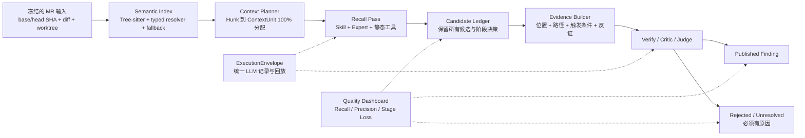

# Review Quality Recall And Precision Optimization Implementation Plan

> **For Claude:** REQUIRED SUB-SKILL: Use superpowers:executing-plans to implement this plan task-by-task.

**Goal:** 在不重写现有三服务架构的前提下，消除主检视上下文硬截断、补齐可信跨文件语义分析、建立全链路可回放执行记录，并通过证据验证降低误报，从而可测量地提升真实代码检视的召回率和精确率。

**Architecture:** 保留现有 PostgreSQL、TypeScript 后端和 Python Review Worker，将主流程升级为“冻结输入 → 语义索引 → ContextUnit 规划 → 高召回候选生成 → Candidate Ledger → Evidence Gate → Judge 发布”的质量漏斗。Skill 调试和真实任务共用同一套 Context Planner、LLM Exchange、Verify/Judge，只允许调试模式增加冻结、追踪和回放能力。

**Tech Stack:** Python 3、现有 Worker orchestration、Tree-sitter、PostgreSQL、TypeScript/Node.js、React、现有 Skill Checkpoint Compiler、现有 Candidate Store 与 Review Artifacts。

---

## 1. 执行摘要

本方案聚焦两个最终指标：

- **召回率（Recall）**：真实问题是否进入候选集合并最终被保留。
- **精确率（Precision）**：最终发布的 Finding 中有多少是真实、可触发、可定位的问题。

Claude 提出的三个问题经过当前代码核查后，结论如下：

| 问题 | 当前代码事实 | 质量影响 | 方案中的直接修复 |
|---|---|---|---|
| Context 丢失、Agent 只看 Patch | Worker 会创建完整 Worktree，Verify/Judge 能读取部分完整源码；但主 Expert 每 Agent 最多选择 12 个文件，单文件 Patch 截取前 1500 字符，DeepAgent `read_file` 主要返回最多 12000 字符的变更 Patch | 大文件后半段、较多变更文件和完整符号语义容易漏检 | ContextUnit v2、全 Hunk 分配、源码按需读取、取消主链路字符硬截断 |
| 800 行切块和正则符号解析粗糙 | 800 行 Diff Slice 已生成，但主 Expert 实际主要消费 `llm_files`；主 `related_context` 仍主要依赖正则和同名符号匹配 | Slice 存在但不保证实际执行；重载、接口实现和跨文件路径不可靠 | 让 ContextUnit 成为真正调度单元；Tree-sitter 成为主语义索引；正则只做降级 |
| 没有跨文件分析能力 | 并非完全没有：已有 repo index、Tree-sitter、部分完整源码；但缺少可信类型关系、多跳路径和任意未修改源码读取 | 未修改调用方、接口实现、配置、测试和事务边界召回不足；同名误关联增加误报 | SemanticGraph v2、可信度分级、只读源码工具、重点语言类型解析 |
| Review 不可复现、没有 Seed | 主 Expert 已有 `seed=13` 和 response cache；Router、DeepAgent、Debate、Critic 等路径没有统一接入；现有重复性门禁只重复评分导出 Findings，不重跑 Worker | 无法可信比较版本前后质量，偶发模型波动会污染 A/B | ExecutionEnvelope、统一 LLM Exchange、Exact Replay、真实 Worker 重跑测试 |

### 1.1 收益判断边界

下列改造有直接代码因果依据，预期可以提高质量，但最终幅度必须由真实 MR A/B 证明：

- 全 Hunk ContextUnit 覆盖：高置信提高召回率。
- 按符号切片并读取完整变更符号：高置信提高召回率。
- 类型级跨文件关系：高概率同时提高跨文件召回率和精确率。
- Evidence Gate 与反证：高概率提高精确率，但必须控制误杀。

下列改造本身不直接提高质量，只保证提升能够被证明：

- Seed。
- Response Cache。
- Exact Replay。
- Run Manifest 和质量仪表盘。

下列做法不纳入本方案，因为可能扩大成本或误报，且没有稳定收益依据：

- 单纯增加 Prompt 长度。
- 单纯提高每 Agent 文件数。
- 单纯增加 Agent 数量。
- 将所有正则同名引用都视为真实调用关系。
- 在 Judge 中继续为单个 rule_id 增加硬编码分支。

## 2. 当前实现证据

### 2.1 主检视上下文

- `mr-backend/worker/prompts/builder.py::_select_agent_files` 默认 `max_files=12`。
- `mr-backend/worker/prompts/builder.py::build_prompt` 对单文件 Patch 使用 `[:1500]`。
- `mr-backend/worker/prompts/builder.py` 对 `changed_symbols`、`modified_symbols` 分别做约 700/800 字符压缩。
- `mr-backend/worker/diff/slicer.py::build_diff_slices` 默认每 Slice 最多 800 个新增行。
- `mr-backend/worker/orchestration/nodes/build_context.py` 只把 `diff_slices` 装入结构化上下文。
- `mr-backend/worker/orchestration/nodes/run_experts.py` 实际调用 Expert 时主要传递 `llm_files`。
- `mr-backend/worker/orchestration/deepagents_runner.py::read_file` 返回变更 Patch，最多 12000 字符。

### 2.2 跨文件上下文

- `mr-backend/worker/context/repo_index.py` 以正则行扫描构建定义和引用。
- 当前限制包括最大文件数、最大行数、定义/调用方数量和总上下文字符数。
- `mr-backend/worker/tools/tree_sitter_tool.py` 已能构建语法图，但没有成为主 `related_context` 的统一来源。
- `mr-backend/worker/tools/gitnexus_tool.py::impact_paths` 当前返回空 `impact_paths`。
- 现有 `scripts/verify_repo_context.py` 只证明简单 Java 示例可找到一个调用方，不能覆盖重载、接口实现和多跳路径。

### 2.3 可复现性与评测

- `mr-backend/worker/llm/client.py` 主 Expert 使用固定 Seed、严格 Schema 和 Response Cache。
- Router、DeepAgent、Targeted Debate、Critic 仍存在直接 HTTP 调用。
- `scripts/verify_real_pr_repeatability.py` 对同一 Gold/Findings 重复评分和反转顺序，不重新执行 Review Worker。
- 当前 `evaluation/real_gold_set.jsonl` 包含 25 个正例和 2 个负样本 MR，共覆盖约 5 个 MR。
- 当前评测结果的 100% Precision/Recall 只能证明导出数据和评分器一致，不能证明真实 Worker 对未知 MR 的质量。

## 3. 目标质量漏斗



### 3.1 质量阶段指标

必须分别记录以下指标，不能只看最终 Finding：

| 阶段 | 指标 | 作用 |
|---|---|---|
| Context Planner | `diff_assignment_rate`、`changed_symbol_resolution_rate`、`dependency_closure_rate` | 判断是否因为上下文缺失导致漏检 |
| Recall Pass | `candidate_recall` | 判断 Agent/Skill 是否产生候选 |
| Verify | `verify_false_reject_count` | 判断验证阶段是否误杀真实问题 |
| Judge | `judge_false_reject_count`、驳回原因分布 | 判断 Judge 是否造成召回损失 |
| Published | `precision`、`recall`、`severity_accuracy` | 衡量最终质量 |
| Negative MR | `negative_false_positive_count` | 衡量无缺陷变更上的误报 |
| Skill | 路由率、加载率、Checkpoint 完成率、未闭环率、命中率、误报率 | 衡量 Skill 真实生效情况 |

## 4. 核心数据契约

### 4.1 ContextUnit v2

新增 `mr-backend/worker/context/context_unit.py`：

```python
from __future__ import annotations

from dataclasses import dataclass, field
from typing import Literal


@dataclass(frozen=True)
class SourceRange:
    file_path: str
    line_start: int
    line_end: int
    content_hash: str


@dataclass(frozen=True)
class DependencyRef:
    relation: str
    symbol_id: str
    source: SourceRange
    confidence: Literal["typed", "syntax", "heuristic"]


@dataclass(frozen=True)
class ContextUnit:
    unit_id: str
    hunk_ids: tuple[str, ...]
    primary_source: SourceRange
    changed_symbol_ids: tuple[str, ...]
    dependencies: tuple[DependencyRef, ...] = field(default_factory=tuple)
    skill_checkpoint_ids: tuple[str, ...] = field(default_factory=tuple)
    token_estimate: int = 0
    unresolved_dependencies: tuple[str, ...] = field(default_factory=tuple)
    context_hash: str = ""
```

强制约束：

- 每个允许进入 LLM 的 Diff Hunk 至少属于一个 ContextUnit。
- ContextUnit 优先按符号边界生成，不能按固定字符数截断。
- 超大符号按语义块切分，并保留 30～50 行重叠窗口。
- Token 不足时把未执行 Unit 标为 `unresolved_budget`，不能算已完成。
- `context_hash` 必须由排序后的源码 Range、依赖边、Skill Checkpoint 和 Planner 版本生成。

### 4.2 SemanticGraph v2

新增 `mr-backend/worker/context/semantic_graph.py`：

```python
from dataclasses import dataclass
from typing import Literal


NodeKind = Literal["file", "class", "interface", "function", "config", "schema", "test"]
EdgeKind = Literal[
    "contains", "imports", "calls", "extends", "implements", "overrides",
    "reads_config", "uses_schema", "tested_by",
]


@dataclass(frozen=True)
class SemanticNode:
    node_id: str
    kind: NodeKind
    name: str
    file_path: str
    line_start: int
    line_end: int


@dataclass(frozen=True)
class SemanticEdge:
    source_id: str
    target_id: str
    kind: EdgeKind
    confidence: Literal["typed", "syntax", "heuristic"]
    resolver: str
```

主路径优先级：

```text
typed > syntax > heuristic
```

规则：

- `heuristic` 边只能用于发现候选上下文，不能单独作为高严重级别 Finding 的可达性证据。
- Tree-sitter 解析失败时必须记录降级原因。
- 第一期支持已有 Java、TypeScript、JavaScript、Python Tree-sitter 能力。
- 第二期为 Java 引入类型级 Resolver；其他语言按真实 MR 占比决定是否接入 LSP。

### 4.3 ExecutionEnvelope v1

所有 LLM 调用必须通过统一封装：

```python
from dataclasses import dataclass
from typing import Any


@dataclass(frozen=True)
class ExecutionEnvelope:
    run_id: str
    operation: str
    agent_id: str
    context_unit_id: str
    checkpoint_id: str
    input_hash: str
    context_hash: str
    prompt_version: str
    provider: str
    model: str
    temperature: float
    top_p: float | None
    seed: int
    request_hash: str
    tool_result_hashes: tuple[str, ...]
    replay_mode: str
```

Seed 由稳定输入派生：

```text
sha256(head_sha + operation + agent_id + context_unit_id + checkpoint_id) 前 8 字节
```

运行模式：

- `record`：真实调用并记录响应与工具结果。
- `replay`：复用记录的响应和工具结果，要求输出完全一致。
- `live_repeat`：禁用响应复用，测量模型自身波动。

### 4.4 EvidencePack v2

新增 `mr-backend/worker/orchestration/judging/evidence_pack.py`：

```python
from dataclasses import dataclass


@dataclass(frozen=True)
class EvidencePack:
    changed_location: dict
    root_cause: str
    trigger_condition: str
    impact: str
    semantic_path: tuple[dict, ...]
    supporting_evidence: tuple[dict, ...]
    contradicting_evidence: tuple[dict, ...]
    verifier_results: tuple[dict, ...]
    unresolved_context: tuple[str, ...]
```

Judge 策略：

- 高严重级别必须具备位置、触发条件和影响路径。
- 跨文件 Finding 必须包含至少一条 `typed` 或 `syntax` 语义边。
- 只有 `heuristic` 边时降低置信度或进入 `needs_review`。
- 上下文不足时使用 `unresolved_context`，不能以“证据不足”静默删除。
- 删除 Candidate 必须写明确原因码，继续复用现有 `candidate_findings.decision_reason_json`。

## 5. 质量门与上线指标

当前真实基线规模不足，因此先使用相对基线门槛；扩充数据集后再确定长期绝对目标。

### 5.1 必须满足的门槛

- `diff_assignment_rate = 100%`。
- 支持 Worktree 的仓库 `full_source_available_rate >= 98%`。
- `changed_symbol_resolution_rate >= 90%`。
- 跨文件 Gold Case Recall 比 v1 提升至少 15 个百分点。
- 整体 Recall 比 v1 提升至少 10 个百分点。
- Critical/High Recall 不低于 95%。
- Context/Semantic 阶段上线时，Precision 下降不得超过 2 个百分点。
- Evidence Gate 上线后，Precision 比 Context/Semantic 阶段提升至少 5 个百分点，Recall 下降不得超过 1 个百分点。
- Negative MR FP 不高于当前基线。
- Exact Replay 的 Candidate Ledger、决策原因和最终 Finding 一致率为 100%。
- 标准 MR 的 P95 Token 和耗时不超过 v1 的 1.5 倍。

### 5.2 必须新增的 Gold Case

至少补充：

- 15 个大文件后半段问题。
- 30 个跨文件问题，包括未修改调用方、接口实现、配置、数据库 Schema 和事务边界。
- 20 个同名/重载负例，用于验证不会错误连接。
- 30 个无问题 MR 或历史误报负例。
- 每个主要 Skill 至少 5 个命中案例和 3 个不命中案例。

## 6. 实施任务

### Task 1: 建立可信的质量基线与真实 Worker A/B

**Files:**

- Modify: `evaluation/real_gold_set.jsonl`
- Create: `evaluation/review_quality_cases/README.md`
- Create: `scripts/test_review_worker_repeatability.py`
- Create: `scripts/verify_review_worker_repeatability.py`
- Create: `scripts/compare_review_quality_runs.py`
- Modify: `scripts/verify_real_pr_repeatability.py`
- Modify: `package.json`

**Step 1: 写失败测试，区分评分器稳定性与 Worker 重跑**

在 `scripts/test_review_worker_repeatability.py` 中构造两个运行快照，断言比较器必须比较：

```python
def test_repeatability_compares_candidates_and_final_findings():
    baseline = {
        "candidate_ids": ["c1", "c2"],
        "finding_ids": ["f1"],
        "decision_reasons": {"c2": ["not_reachable"]},
    }
    repeated = {
        "candidate_ids": ["c1"],
        "finding_ids": ["f1"],
        "decision_reasons": {},
    }
    report = compare_worker_runs(baseline, repeated)
    assert report["exact_match"] is False
    assert report["candidate_jaccard"] < 1.0
```

**Step 2: 运行测试并确认失败**

Run: `python3 scripts/test_review_worker_repeatability.py`

Expected: FAIL，提示 `compare_worker_runs` 不存在。

**Step 3: 实现最小比较器**

`verify_review_worker_repeatability.py` 必须读取两个真实 `review_run_id` 的：

- `candidate_findings`
- `review_findings`
- `llm_call_records`
- `review_artifacts`
- `coverage_json`

输出 Candidate Jaccard、Finding Jaccard、Severity Agreement、决策原因差异和 Context Hash 差异。

**Step 4: 保留旧脚本但更正名称和职责**

将 `scripts/verify_real_pr_repeatability.py` 输出中的 `verified` 改为 `real_pr_scorer_determinism`，避免继续声称它验证 Worker 重跑。

**Step 5: 扩充评测数据说明**

在 `evaluation/review_quality_cases/README.md` 定义 Case Schema、人工标注流程、双人复核规则和大文件/跨文件/负样本配比。

**Step 6: 运行验证**

Run: `python3 scripts/test_review_worker_repeatability.py && npm run verify:real-prs && npm run verify:real-pr-repeatability`

Expected: PASS；旧质量门不回退，新脚本明确输出 scorer determinism。

**Step 7: Commit**

```bash
git add evaluation scripts package.json
git commit -m "test: establish review worker quality baseline"
```

### Task 2: 增加 Context 健康度观测，不改变检视行为

**Files:**

- Create: `mr-backend/worker/context/context_metrics.py`
- Create: `mr-backend/worker/tests/test_context_metrics.py`
- Modify: `mr-backend/worker/orchestration/nodes/build_context.py`
- Modify: `mr-backend/worker/orchestration/nodes/finalize.py`
- Modify: `mr-backend/src/backend/services/ObservabilityService.ts`
- Modify: `mr-backend/src/backend/routes/review.routes.ts`

**Step 1: 写失败测试**

覆盖以下输入：20 个 Hunk、16 个成功分配、2 个因源码缺失未分配、2 个因预算未执行。

```python
def test_context_metrics_exposes_unassigned_and_unresolved_hunks():
    metrics = summarize_context_coverage(total=20, assigned=16, unresolved_source=2, unresolved_budget=2)
    assert metrics["diff_assignment_rate"] == 0.8
    assert metrics["unresolved_hunk_count"] == 4
    assert metrics["status"] == "partial"
```

**Step 2: 运行测试并确认失败**

Run: `PYTHONPATH=mr-backend/worker python3 mr-backend/worker/tests/test_context_metrics.py`

Expected: FAIL，提示 `context.context_metrics` 不存在。

**Step 3: 实现通用 Context 指标**

输出至少包括：

```json
{
  "context_engine": "v1",
  "worktree_mode": "full",
  "source_fetch_rate": 0.95,
  "semantic_parse_rate": 0.88,
  "changed_symbol_resolution_rate": 0.82,
  "diff_assignment_rate": 0.80,
  "context_units_total": 0,
  "context_units_executed": 0,
  "context_units_unresolved": 4,
  "status": "partial"
}
```

**Step 4: 写入现有 `review_runs.coverage_json`**

不新增表，先复用现有字段；所有失败和降级必须显式写入。

**Step 5: 运行验证**

Run: `PYTHONPATH=mr-backend/worker python3 mr-backend/worker/tests/test_context_metrics.py && npm run build`

Expected: PASS；现有 Review API 可返回 `context_health`。

**Step 6: Commit**

```bash
git add mr-backend/worker/context mr-backend/worker/orchestration mr-backend/worker/tests mr-backend/src/backend
git commit -m "feat: expose review context health metrics"
```

### Task 3: 用 ContextUnit v2 取代主 Prompt 硬截断

**Files:**

- Create: `mr-backend/worker/context/context_unit.py`
- Create: `mr-backend/worker/context/context_planner.py`
- Create: `mr-backend/worker/tests/test_context_planner.py`
- Modify: `mr-backend/worker/diff/slicer.py`
- Modify: `mr-backend/worker/orchestration/nodes/build_context.py`
- Modify: `mr-backend/worker/orchestration/nodes/run_experts.py`
- Modify: `mr-backend/worker/prompts/builder.py`

**Step 1: 写大文件后半段失败测试**

构造一个 1200 行文件，在第 950 行附近加入变更，断言该 Hunk 出现在一个实际可执行 ContextUnit 中，且 Prompt 包含第 950 行而不是只包含文件开头。

**Step 2: 写 20 文件覆盖失败测试**

构造 20 个各含一个 Hunk 的变更文件，断言：

```python
assert result.diff_assignment_rate == 1.0
assert set(result.assigned_hunk_ids) == set(all_hunk_ids)
```

**Step 3: 运行测试并确认失败**

Run: `PYTHONPATH=mr-backend/worker python3 mr-backend/worker/tests/test_context_planner.py`

Expected: FAIL，提示 `ContextPlanner` 不存在。

**Step 4: 实现符号优先规划**

规划顺序：

```text
Hunk → enclosing symbol → complete symbol source → dependency refs → Skill checkpoint → token packing
```

找不到符号时退化为 Hunk 上下各 80 行；退化必须记录 `fallback_reason=no_symbol`。

**Step 5: 修改 Prompt Builder**

- 新增 `build_context_unit_prompt(...)`。
- 主发现路径不再调用 `_select_agent_files(..., max_files=12)`。
- 主发现路径不再使用 Patch `[:1500]`。
- `_select_agent_files` 仅保留给 `context_engine=v1` 回滚路径。

**Step 6: 修改 Expert 调度**

按 Agent + Skill Checkpoint + ContextUnit 生成执行批次；预算耗尽时把剩余 Unit 标为 `unresolved_budget`。

**Step 7: 运行测试和质量门**

Run: `PYTHONPATH=mr-backend/worker python3 mr-backend/worker/tests/test_context_planner.py && npm run verify:worker-quality && npm run verify:real-prs`

Expected: PASS；所有测试 Hunk 分配率 100%；现有质量指标不回退超过约定门槛。

**Step 8: Commit**

```bash
git add mr-backend/worker/context mr-backend/worker/diff mr-backend/worker/orchestration mr-backend/worker/prompts mr-backend/worker/tests
git commit -m "feat: review code through semantic context units"
```

### Task 4: 建立 SemanticGraph v2 和冻结源码工具

**Files:**

- Create: `mr-backend/worker/context/semantic_graph.py`
- Create: `mr-backend/worker/context/source_tools.py`
- Create: `mr-backend/worker/tests/test_semantic_graph.py`
- Create: `mr-backend/worker/tests/test_source_tools.py`
- Modify: `mr-backend/worker/context/repo_index.py`
- Modify: `mr-backend/worker/tools/tree_sitter_tool.py`
- Modify: `mr-backend/worker/tools/gitnexus_tool.py`
- Modify: `mr-backend/worker/orchestration/deepagents_runner.py`
- Modify: `mr-backend/worker/orchestration/nodes/build_context.py`

**Step 1: 写语义关系失败测试**

至少覆盖：

- 接口与两个实现类。
- 同名但不同类型的方法。
- 方法重载。
- 未修改调用方。
- 测试类与被测符号。
- 配置键与读取位置。

断言真实关系存在，错误同名关系不能获得 `typed` 或 `syntax` 可信度。

**Step 2: 写源码工具隔离测试**

断言 `read_source_range` 只能读取当前 Run 冻结的 Head SHA Worktree，拒绝路径穿越和工作区外路径。

**Step 3: 运行测试并确认失败**

Run: `PYTHONPATH=mr-backend/worker python3 mr-backend/worker/tests/test_semantic_graph.py && PYTHONPATH=mr-backend/worker python3 mr-backend/worker/tests/test_source_tools.py`

Expected: FAIL，提示语义图和源码工具不存在。

**Step 4: 统一 Tree-sitter 输出**

把已有 Tree-sitter 节点和边映射为 `SemanticNode`/`SemanticEdge`；保留原工具观察，避免一次迁移破坏现有静态规则。

**Step 5: 降级正则索引**

`repo_index.py` 只在 Tree-sitter 不支持语言或解析失败时产生 `heuristic` 边，并记录 Resolver 与降级原因。

**Step 6: 实现只读源码工具**

提供：

```text
read_source_range
find_symbol
find_callers
find_callees
find_implementations
find_tests
find_config_refs
```

**Step 7: 修正 GitNexus 能力声明**

在 `impact_paths` 未真正实现前，工具返回状态必须是 `unsupported`，不能用空数组表示“已分析且无影响”。

**Step 8: 运行验证**

Run: `PYTHONPATH=mr-backend/worker python3 mr-backend/worker/tests/test_semantic_graph.py && PYTHONPATH=mr-backend/worker python3 mr-backend/worker/tests/test_source_tools.py && python3 scripts/verify_repo_context.py`

Expected: PASS；简单旧用例继续通过，新增接口/重载/未修改调用方用例通过。

**Step 9: Commit**

```bash
git add mr-backend/worker/context mr-backend/worker/tools mr-backend/worker/orchestration mr-backend/worker/tests
git commit -m "feat: add semantic cross-file review context"
```

### Task 5: 统一所有 LLM 调用并支持 Exact Replay

**Files:**

- Create: `mr-backend/worker/llm/exchange.py`
- Create: `mr-backend/worker/tests/test_llm_execution_envelope.py`
- Create: `mr-backend/worker/tests/test_worker_exact_replay.py`
- Modify: `mr-backend/worker/llm/client.py`
- Modify: `mr-backend/worker/orchestration/deepagents_runner.py`
- Modify: `mr-backend/worker/orchestration/nodes/critic_pass.py`
- Modify: `mr-backend/worker/orchestration/nodes/run_targeted_debate.py`
- Modify: `mr-backend/worker/review_runtime.py`
- Modify: `mr-backend/worker/orchestration/nodes/finalize.py`
- Modify: `mr-backend/src/backend/db/migrations.ts`
- Modify: `mr-backend/src/backend/routes/review.routes.ts`
- Modify: `package.json`

**Step 1: 写统一入口失败测试**

对 Expert、Router、DeepAgent、Debate、Critic、Judge、Summary 逐项断言：请求必须包含稳定 Seed、Operation、Context Hash 和 Request Hash。

**Step 2: 写 Exact Replay 失败测试**

第一次使用 `record` 模式保存两次 LLM 响应和一次工具结果；第二次使用 `replay`，断言不会发生 HTTP 请求，Candidate 和最终 Finding 完全一致。

**Step 3: 运行测试并确认失败**

Run: `PYTHONPATH=mr-backend/worker python3 mr-backend/worker/tests/test_llm_execution_envelope.py && PYTHONPATH=mr-backend/worker python3 mr-backend/worker/tests/test_worker_exact_replay.py`

Expected: FAIL，提示统一 Exchange 不存在或直接调用未被拦截。

**Step 4: 扩展现有记录表**

在 `llm_call_records` 增加：

```text
operation
context_unit_id
checkpoint_id
seed
temperature
request_hash
response_hash
cache_key
replay_source
response_artifact_id
```

完整响应按数据策略写入 `review_artifacts`；默认生产策略可使用加密存储或 Hash-only，Skill Debug Exact Replay 必须启用允许回放的存储策略和 TTL。

**Step 5: 消除直接 HTTP 调用**

Router、DeepAgent、Debate、Critic、Summary 全部调用 `llm.exchange.execute(...)`；CI 新增静态检查，禁止 orchestration 节点直接调用 `chat_completions_url`。

**Step 6: 运行缓存和回放验证**

Run: `PYTHONPATH=mr-backend/worker python3 mr-backend/worker/tests/test_llm_execution_envelope.py && PYTHONPATH=mr-backend/worker python3 mr-backend/worker/tests/test_worker_exact_replay.py && npm run verify:llm-schema-cache`

Expected: PASS；Exact Replay 不发送网络请求，输出完全一致。

**Step 7: Commit**

```bash
git add mr-backend/worker/llm mr-backend/worker/orchestration mr-backend/worker/review_runtime.py mr-backend/worker/tests mr-backend/src/backend package.json
git commit -m "feat: record and replay every review model call"
```

### Task 6: 用 EvidencePack 和反证提高精确率

**Files:**

- Create: `mr-backend/worker/orchestration/judging/evidence_pack.py`
- Create: `mr-backend/worker/tests/test_evidence_pack.py`
- Modify: `mr-backend/worker/orchestration/judging/evidence_score.py`
- Modify: `mr-backend/worker/orchestration/nodes/verify_findings.py`
- Modify: `mr-backend/worker/orchestration/nodes/critic_pass.py`
- Modify: `mr-backend/worker/orchestration/nodes/judge_findings.py`
- Modify: `mr-backend/worker/tools/candidate_store.py`
- Modify: `mr-backend/worker/tests/test_judge_decision_accountability.py`

**Step 1: 写证据与反证失败测试**

覆盖：

- 有变更位置、有类型路径、有可触发条件的高置信问题。
- 只有同名正则关系的跨文件候选。
- 存在空值保护、权限拦截或事务补偿的反证。
- 上下文缺失而无法判断的候选。

预期状态分别为 `confirmed`、`needs_review`、`rejected_with_reason`、`unresolved_context`。

**Step 2: 运行测试并确认失败**

Run: `PYTHONPATH=mr-backend/worker python3 mr-backend/worker/tests/test_evidence_pack.py`

Expected: FAIL，提示 `EvidencePack` 不存在。

**Step 3: 实现结构化证据包**

Evidence Builder 从变更源码、Semantic Path、工具观察和 Critic 反证生成 `EvidencePack`；不按具体 Rule 写分支。

**Step 4: 调整 Evidence Score**

新增通用组件：

- `semantic_path_strength`
- `trigger_specificity`
- `contradiction_penalty`
- `context_completeness`

保留现有位置、Snippet、工具、规则和共识组件。

**Step 5: 保留所有 Candidate 决策**

复用 `candidate_findings`，禁止 Judge 物理删除 Candidate；每个终态必须有 `decision_stage`、`decision_reason_json`、`decided_at`。

**Step 6: 运行验证**

Run: `PYTHONPATH=mr-backend/worker python3 mr-backend/worker/tests/test_evidence_pack.py && npm run verify:worker-quality && npm run verify:judge-decision-accountability && npm run verify:real-prs`

Expected: PASS；空原因删除率为 0；Recall 下降不超过门槛。

**Step 7: Commit**

```bash
git add mr-backend/worker/orchestration mr-backend/worker/tools mr-backend/worker/tests
git commit -m "feat: verify findings with semantic evidence packs"
```

### Task 7: 让 Skill 声明证据范围并保持调试/生产一致

**Files:**

- Modify: `mr-backend/src/backend/services/SkillCheckpointCompiler.ts`
- Modify: `mr-backend/src/backend/services/SkillDebugSnapshotService.ts`
- Modify: `mr-backend/worker/orchestration/nodes/route_agents.py`
- Modify: `mr-backend/worker/orchestration/nodes/build_context.py`
- Modify: `mr-backend/worker/orchestration/nodes/run_experts.py`
- Modify: `mr-backend/worker/tests/test_skill_checkpoint_manifest.py`
- Modify: `mr-backend/worker/tests/test_skill_debug_isolation.py`
- Create: `mr-backend/worker/tests/test_skill_context_requirements.py`

**Step 1: 写 Skill Context Schema 失败测试**

支持可选字段：

```yaml
evidence_scope: cross_file
context_queries:
  - callers
  - implementations
  - tests
max_dependency_hops: 2
```

旧 Skill 未声明时默认 `evidence_scope=symbol`、`max_dependency_hops=1`，保证兼容。

**Step 2: 写调试/生产一致性失败测试**

给定同一个 Skill Version、MR Snapshot 和模型回放记录，断言 Skill Debug 与真实任务生成相同：

- ContextUnit Hash。
- Checkpoint 执行集合。
- Candidate Ledger。
- Judge 决策。

**Step 3: 运行测试并确认失败**

Run: `PYTHONPATH=mr-backend/worker python3 mr-backend/worker/tests/test_skill_context_requirements.py && PYTHONPATH=mr-backend/worker python3 mr-backend/worker/tests/test_skill_debug_isolation.py`

Expected: FAIL，提示 Context Requirement 尚未编译或 Context Hash 不一致。

**Step 4: 扩展 Compiler 和 Manifest**

编译阶段验证字段取值、最大跳数和查询类型；不支持的查询必须在上传/保存时明确报错。

**Step 5: 统一执行路径**

Debug 与 Production 共同调用 Context Planner、LLM Exchange、Verify、Critic 和 Judge。Debug 只设置：

```text
execution_kind=skill_debug
snapshot_mode=frozen
trace_level=full
replay_mode=record|replay
```

**Step 6: 运行 Skill 回归**

Run: `npm run verify:skill-checkpoint-compiler && npm run verify:skill-checkpoint-manifest && npm run verify:skill-debug-workbench && npm run verify:skill-runtime-facts`

Expected: PASS；旧 Skill 兼容，新 Skill 可驱动跨文件 Context 查询。

**Step 7: Commit**

```bash
git add mr-backend/src/backend/services mr-backend/worker/orchestration mr-backend/worker/tests
git commit -m "feat: bind skill checkpoints to semantic context"
```

### Task 8: 增加真实任务质量仪表盘和灰度开关

**Files:**

- Modify: `mr-backend/src/backend/services/ObservabilityService.ts`
- Modify: `mr-backend/src/backend/routes/quality.routes.ts`
- Modify: `mr-backend/src/backend/routes/review.routes.ts`
- Modify: `frontend/src/frontend/components/ReviewViews.tsx`
- Create: `scripts/verify-review-context-dashboard.mjs`
- Modify: `package.json`
- Modify: `README.md`

**Step 1: 写 API/UI 失败验证**

验证 Review Detail API 返回：

```text
context_health
candidate_recall
verify_rejection_reasons
judge_rejection_reasons
published_precision
skill_checkpoint_metrics
reproducibility
```

**Step 2: 运行验证并确认失败**

Run: `node scripts/verify-review-context-dashboard.mjs`

Expected: FAIL，提示缺少 `context_health` 或 `reproducibility`。

**Step 3: 实现页面卡片**

Review 页面增加：

- Context Health。
- Quality Funnel。
- Skill Checkpoint Coverage。
- Reproducibility。
- 未闭环 Candidate 列表。

页面必须明确显示 `full / partial / patch_only / blocked`，不能用空数据表示成功。

**Step 4: 加入灰度配置**

项目级配置：

```json
{
  "review_quality": {
    "context_engine": "v1",
    "semantic_index": "tree_sitter",
    "llm_replay": "record",
    "quality_shadow_mode": true
  }
}
```

允许值：

- `context_engine`: `v1 | v2`
- `semantic_index`: `regex | tree_sitter | typed`
- `llm_replay`: `off | record | replay | live_repeat`

**Step 5: 更新 README**

说明默认配置、Windows 内网环境下的源码索引依赖、数据保留策略、回放数据安全和回滚方式。

**Step 6: 运行完整验证**

Run: `node scripts/verify-review-context-dashboard.mjs && npm run build && npm run verify:review-coverage-ui && npm run verify:skill-runtime-dashboard-ui`

Expected: PASS；v1/v2 可在项目级切换。

**Step 7: Commit**

```bash
git add mr-backend/src/backend frontend/src scripts package.json README.md
git commit -m "feat: expose review quality and context dashboard"
```

### Task 9: Shadow A/B、质量门和正式切换

**Files:**

- Create: `scripts/run-review-quality-shadow.mjs`
- Create: `scripts/verify-review-quality-uplift.mjs`
- Modify: `package.json`
- Modify: `docs/plans/2026-07-13-review-quality-recall-precision-optimization-plan.md`

**Step 1: 写质量门失败测试**

构造一份 Recall 提升但 Precision 下降 5 个百分点的报告，断言不能通过；构造 Recall +10pp、跨文件 Recall +15pp、Precision -1pp 的报告，断言允许进入下一阶段。

**Step 2: 运行测试并确认失败**

Run: `node scripts/verify-review-quality-uplift.mjs --fixture scripts/fixtures/review-quality-gate-fail.json`

Expected: FAIL，并输出具体未满足指标。

**Step 3: 实现 Shadow Runner**

同一个冻结 MR Snapshot 同时运行：

- v1 Context Engine。
- v2 Context Engine。

Shadow 结果不得写回生产 Review 评论，只写质量评测表和 Artifacts。

**Step 4: 执行分阶段灰度**

```text
内部项目 10% → 内部项目 30% → 内部项目 100% → 外部项目 10% → 全量
```

每阶段至少累计 30 个有效 MR；任何质量门失败都回滚到 v1。

**Step 5: 运行最终质量门**

Run: `npm run verify:real-prs && node scripts/verify-review-quality-uplift.mjs --baseline <v1-report> --candidate <v2-report>`

Expected: 所有第 5 节指标满足后才允许把默认 `context_engine` 切换为 `v2`。

**Step 6: 记录最终结果**

在本文末尾追加实际样本数、Precision、Recall、跨文件 Recall、Negative FP、P95 Token 和 P95 Duration；不得只写“验证通过”。

**Step 7: Commit**

```bash
git add scripts package.json docs/plans/2026-07-13-review-quality-recall-precision-optimization-plan.md
git commit -m "test: gate review quality v2 rollout"
```

## 7. 实施顺序与工期估算

| 阶段 | 内容 | 预计工程量 | 是否直接改善质量 |
|---|---|---:|---|
| P0 | Task 1～2：真实基线、Worker 重跑、Context 指标 | 4～6 人日 | 否，建立可信测量 |
| P1 | Task 3：ContextUnit v2 | 5～7 人日 | 是，主要提升 Recall |
| P2 | Task 4：SemanticGraph 与源码工具 | 7～10 人日 | 是，提升跨文件 Recall/Precision |
| P3 | Task 5：统一 LLM Exchange 与回放 | 5～7 人日 | 否，保证可复现和 A/B 可信 |
| P4 | Task 6：EvidencePack 与反证 | 5～7 人日 | 是，主要提升 Precision |
| P5 | Task 7～8：Skill 一致性、仪表盘和灰度开关 | 5～7 人日 | 间接改善并形成闭环 |
| P6 | Task 9：Shadow A/B 与正式切换 | 3～5 人日 + 样本积累 | 验证实际收益 |

单人完整实施约 6～8 周。若缩小第一期范围，建议先完成 P0、P1、P2、P4，并同步完成 P3 的最小记录能力；不要先做完整 UI。

## 8. 风险与控制措施

### 8.1 Token 和延迟上涨

控制：Context Planner 使用每 Unit 预算和依赖优先级，不把全仓库直接塞进 Prompt；标准 MR P95 上限为 v1 的 1.5 倍。

### 8.2 语义边错误导致误报

控制：边分为 `typed / syntax / heuristic`；高严重级别不得仅由 heuristic 边支撑；同名正则只用于扩展候选。

### 8.3 Evidence Gate 误杀导致 Recall 下降

控制：所有 Candidate 保留；不确定候选进入 `needs_review` 或 `unresolved_context`；Recall 下降超过 1pp 时不能上线。

### 8.4 回放数据包含敏感源码

控制：遵守项目 Data Policy；生产默认 Hash-only 或加密 Artifact；Debug 回放使用项目授权、TTL 和访问审计。

### 8.5 Skill Debug 与真实任务再次分叉

控制：两者不能分别实现 Context、LLM、Verify 或 Judge；Debug 只能通过 Execution Flags 改变冻结、追踪和回放策略。

## 9. 回滚方案

任何阶段均通过项目配置回滚：

```json
{
  "review_quality": {
    "context_engine": "v1",
    "semantic_index": "regex",
    "llm_replay": "off",
    "quality_shadow_mode": false
  }
}
```

回滚要求：

- 不删除 v2 生成的 Candidate、Artifacts 和质量报告。
- 不回滚数据库迁移，只停止读取新字段。
- Skill Debug 与 Production 同时回到 v1，禁止只回滚一条路径。
- 在质量报告中记录回滚时间、触发指标和影响 MR。

## 10. Definition of Done

只有同时满足以下条件，方案才算完成：

- Claude 指出的 Context、跨文件和复现问题均有自动化回归用例。
- 所有 Diff Hunk 都有明确的 ContextUnit 归属或未解决原因。
- 主 Expert 不再依赖 12 文件和 1500 字符硬截断。
- Tree-sitter/SemanticGraph 成为主跨文件上下文来源，正则只做降级。
- Agent 可以安全读取冻结 Head SHA 下的未修改源码。
- 所有 LLM 节点通过统一 Exchange，Exact Replay 一致率 100%。
- Judge 不会无原因删除 Candidate。
- Skill Debug 与真实任务在相同冻结输入下产生相同 Context Plan 和执行链。
- 扩充后的真实 Gold Set 完成双人复核。
- Shadow A/B 达到第 5 节 Recall、Precision、Negative FP、成本和延迟门槛。
- README 包含启动配置、Windows 内网依赖、数据策略、灰度和回滚说明。

## 11. 2026-07-13 实施与验证记录

### 11.1 已落地的工程能力

- Context Health、ContextUnit v2、Tree-sitter SemanticGraph、冻结 Head SHA 源码工具与跨文件依赖查询已接入生产 Review Graph。
- Expert、Router、DeepAgent、Debate、Critic、Summary 已统一经过 LLM Exchange；稳定 Seed、Operation、Context Hash、Request/Response Hash 和 Replay Source 会写入调用记录。
- Exact Replay 自动化用例覆盖两次模型响应，并把中间工具消息及其 Hash 纳入第二次请求指纹；Replay 模式断言模型网络调用为 0 且 Candidate/Finding 完全一致。冻结源码工具仍从同一 Head SHA Worktree 读取，外部非确定性工具必须先冻结为输入 Artifact，不能在回放时重新抓取实时结果。
- EvidencePack 已区分 `confirmed / needs_review / rejected_with_reason / unresolved_context`；启发式同名关系不能自动确认，反证和上下文缺失均保留明确原因。
- Skill Checkpoint 编译器支持 `evidence_scope`、`context_queries` 和 `max_dependency_hops`；Skill Debug 与 Production 共用 Context Planner、Exchange、Verify、Critic 和 Judge。
- Review Detail 与项目质量接口已暴露 Context Health、Candidate Funnel、Verifier/Judge 拒绝原因、反馈精确率、Checkpoint 指标、未闭环 Candidate 和可复现状态。
- 项目配置支持 `context_engine / semantic_index / llm_replay / quality_shadow_mode`，README 已记录 Windows 内网依赖、回放数据策略和回滚顺序。
- Shadow Runner 强制冻结 Snapshot、同输入 v1/v2 双跑和 `publish_allowed=false`；质量门覆盖 Recall、跨文件 Recall、Critical/High Recall、Precision、Negative FP、P95 Token 和 P95 Duration。
- 超大符号中的远距离 Hunk 会拆成独立 ContextUnit，并保留 40 行语义窗口，避免固定 400 行中心裁剪遗漏两端；SemanticGraph 现已记录接口多实现、未修改调用方、测试导入与配置读取关系。
- 完整响应的 Exact Replay 存储改为显式 Data Policy 授权，并写入 `review_run_id`、TTL；新建表和旧表升级都包含留存列，PostgreSQL 时间比较统一使用 `timestamptz` 转换。
- `live_repeat` 已强制绕过旧 Response Cache；缓存命中也会进入统一 Exchange 指纹链。DeepAgent 缺少 Exchange Recorder 时直接失败，不能再旁路发起模型 HTTP 请求。
- Expert 输出契约升级为 `review_findings_v2`，要求显式给出触发条件、影响和跨文件 `semantic_evidence`；Worker 只接受 Context Planner 真实依赖表中能精确匹配的语义边，模型臆造的边会进入 `unresolved_context`，不能获得可信证据分。
- Context Health 的 Diff 分配率按 Hunk 计数而不是按 ContextUnit 容器数计数，ContextUnit 的“已执行”只在真实 Expert 执行后更新，避免仪表盘把尚未执行的上下文标成完成。

### 11.2 当前实测结果

| 指标 | 当前结果 | 证据范围 |
|---|---:|---|
| 全仓回归 | PASS | `npm run verify` |
| Review Quality v2 专项回归 | PASS | `npm run verify:review-quality-v2` |
| 当前 Real PR 样本数 | 5 MR / 25 Gold Finding | 仓库现有 Real PR fixture |
| 当前 Real PR Precision | 100% | `npm run verify:real-prs`；这是现有导出/评分 fixture，不等同未知 MR Shadow A/B |
| 当前 Real PR Recall | 100% | 同上 |
| 当前 Negative MR FP | 0 / 2 Negative MR | 同上 |
| Exact Replay 一致率 | 100% | 自动化用例 2 次 LLM Exchange；Replay 网络调用 0 次 |
| Shadow Runner 机制用例 | 2 个冻结 Snapshot，v1/v2 均执行且发布尝试 0 | 机制测试，不计入上线样本 |
| 有效生产 Shadow A/B 样本 | 0 / 30 | 尚未在真实内部项目累计 |
| 生产 v1/v2 跨文件 Recall 提升 | 未采集 | 需真实 Shadow A/B Gold 标注 |
| 生产 v1/v2 P95 Token | 未采集 | 需至少 30 个有效 MR |
| 生产 v1/v2 P95 Duration | 未采集 | 需至少 30 个有效 MR |

### 11.3 正式切换状态

当前保守默认仍为 v1，项目可在 Shadow 环境显式启用 v2，但**尚不能声称达到生产上线质量门**。原因不是代码或自动化失败，而是第 5 节要求的人工双人复核扩展 Gold Set 和每阶段至少 30 个真实 MR 尚无外部标注/样本。质量门会把样本少于 30、缺少跨文件 Recall 或缺少 P95 成本数据的报告判为失败。正式推广必须依次完成 `internal_10 → internal_30 → internal_100 → external_10 → full`；任一阶段失败即把 `context_engine` 回滚为 `v1`，不得用本节的机制 fixture 代替生产证据。
